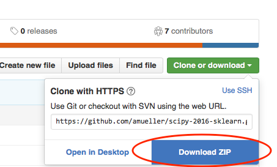
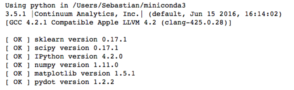

SciPy 2016 Scikit-learn Tutorial
================================

Based on the SciPy [2015 tutorial](https://github.com/amueller/scipy_2015_sklearn_tutorial) by [Kyle Kastner](https://kastnerkyle.github.io/) and [Andreas Mueller](http://amueller.github.io).


Instructors
-----------

- [Sebastian Raschka](http://sebastianraschka.com)  [@rasbt](https://twitter.com/rasbt) - Michigan State University, Computational Biology
- [Andreas Mueller](http://amuller.github.io) [@t3kcit](https://twitter.com/t3kcit) - NYU Center for Data Science


This repository will contain the teaching material and other info associated with our scikit-learn tutorial
at [SciPy 2016](http://scipy2016.scipy.org/ehome/index.php?eventid=146062&tabid=332930&) held July 11-17 in Austin, Texas.

Parts 1 to 5 make up the morning session, while
parts 6 to 9 will be presented in the afternoon.

### Schedule:

The 2-part tutorial will be held on Tuesday, July 12, 2016.

- Parts 1 to 5: 8:00 AM - 12:00 PM (Room 105)
- Parts 6 to 9: 1:30 PM - 5:30 PM (Room 105)

(You can find the full SciPy 2016 tutorial schedule [here](http://scipy2016.scipy.org/ehome/146062/332960/).)


Obtaining the Tutorial Material
------------------


If you have a GitHub account, it is probably most convenient if you fork the GitHub repository. If you don’t have an GitHub account, you can download the repository as a .zip file by heading over to the GitHub repository (https://github.com/amueller/scipy-2016-sklearn) in your browser and click the green “Download” button in the upper right.



Please note that we may add and improve the material until shortly before the tutorial session, and we recommend you to update your copy of the materials one day before the tutorials. If you have an GitHub account and forked/cloned the repository via GitHub, you can sync your existing fork with via the following commands:

```
git remote add upstream https://github.com/amueller/scipy-2016-sklearn.git
git fetch upstream
git checkout master merge upstream/master
```

If you don’t have a GitHub account, you may have to re-download the .zip archive from GitHub.


Installation Notes
------------------

This tutorial will require recent installations of *[NumPy](http://www.numpy.org)*, *[SciPy](http://www.scipy.org)*,
*[matplotlib](http://matplotlib.org)*, *[scikit-learn](http://scikit-learn.org/stable/)* and *[IPython](http://ipython.readthedocs.org/en/stable/)* together with the *[Jupyter Notebook](http://jupyter.org)*.

The last one is important, you should be able to type:

    jupyter notebook

in your terminal window and see the notebook panel load in your web browser.
Try opening and running a notebook from the material to see check that it works.

For users who do not yet have these  packages installed, a relatively
painless way to install all the requirements is to use a Python distribution
such as [Anaconda CE](http://store.continuum.io/ "Anaconda CE"), which includes
the most relevant Python packages for science, math, engineering, and
data analysis; Anaconda can be downloaded and installed for free
including commercial use and redistribution.
The code examples in this tutorial should be compatible to Python 2.7,
Python 3.4, and Python 3.5.

After obtaining the material, we **strongly recommend** you to open and execute the Jupyter Notebook
`python check_env.ipynb` that is located at the top level of this repository. Inside the repository, you can open the notebook
by executing

```bash
jupyter notebook check_env.ipynb
```

inside this repository. Inside the Notebook, you can run the code cell by
clicking on the "Run Cells" button as illustrated in the figure below:


Finally, if your environment satisfies the requirements for the tutorials, the executed code cell will produce an output message as shown below:




Although not required, we also recommend you to update the required Python packages to their latest versions to ensure best compatibility with the teaching material. Please upgrade already installed packages by executing

- `pip install [package-name] --upgrade`  
- or `conda update [package-name]`


Data Downloads
--------------

The data for this tutorial is not included in the repository.  We will be
using several data sets during the tutorial: most are built-in to
scikit-learn, which
includes code that automatically downloads and caches these
data.

**Because the wireless network
at conferences can often be spotty, it would be a good idea to download these
data sets before arriving at the conference.
Please run ``python fetch_data.py`` to download all necessary data beforehand.**

(Combined, the datasets have a file size of ~135 MB, and are stored in the `./notebook` subdirectory after running the `python fetch_data.py` script from this directory.)


Outline
=======

Coming soon
