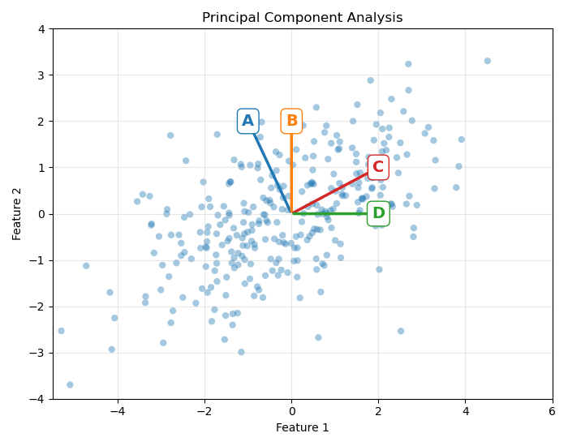
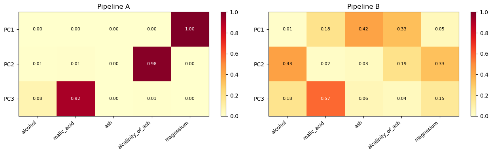

# ✅ Quiz M8.01


We consider the 2D data as follows:




```{admonition} Question
What is the direction of the first component of this data cloud?

- a) A
- b) B
- c) C
- d) D

_Select a single answer_

```

+++

The heatmaps below show the squared loadings of the first three principal
components for two different pipelines:



```{admonition} Question
Assume the variance of the raw `alcohol` column is of order 10. What is the
difference between pipeline A and pipeline B?

- a) Pipeline A converted magnesium, alcalinity and malic acid into binary
  features while Pipeline B retained their original numerical values
- b) Pipeline B shuffled the data while pipeline A didn't
- c) Pipeline B scaled the data while pipeline A didn't

_Select a single answer_
```

+++

```{admonition} Question
In the following cases, select the ones where it is useful to use a PCA:

- a) To visualize data in the presence of too many features
- b) To predict consumer churn for internet contracts from the following
  features: gender, type of internet service provided (Fiber, DSL, etc), payment
  method, type of day (workday or weekend), state where the person lives
- c) To predict the pollution in an almost **straight** river from the GPS
  coordinates, flow rate and distance to the nearest city
- d) To reduce underfitting in my supervised task

_Select all answers that apply_
```

+++

```{admonition} Questions
Select the true statements about PCA:

- a) Fewer dimensions means faster training.
- b) Reducing the number of features with PCA makes a model easier to audit and act on,
  since fewer dimensions are always simpler to interpret than more.
- c) By discarding the flat, noisy directions, PCA can reduce overfitting.

_Select all answers that apply_
```
