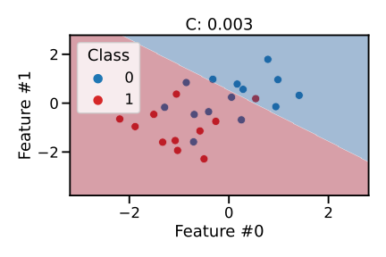
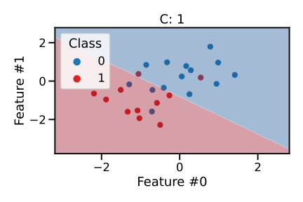

# ✅ Quiz M7.04

```{admonition} Question
What is the default score in scikit-learn when using a classifier?

- a) balanced accuracy
- b) ROC-AUC
- c) accuracy

_Select a single answer_
```

+++

```{admonition} Question
Other than the decision threshold, metrics such as recall and precision also
depend on the regularization parameters. Assuming that class "1" (in red) is the
positive class, use the following figures to select which statements are true in
this particular logistic regression model:




- a) stronger regularization leads to higher precision
- b) stronger regularization leads to lower precision
- c) stronger regularization leads to higher recall
- d) stronger regularization leads to lower recall

_Select all answers that apply_
```
