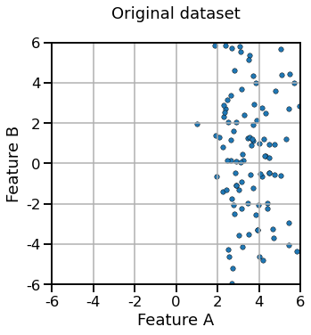

# ✅ Quiz M1.02

```{admonition} Question
Why do we need two sets: a train set and a test set?

- a) to train the model faster
- b) to validate the model on unseen data
- c) to improve the accuracy of the model

_Select all answers that apply_
```

+++

```{admonition} Question
The generalization performance of a scikit-learn model can be evaluated by:

- a) calling `fit` to train the model on the **training set**, `predict` on the
  **test set** to get the predictions, and compute the score by passing the
  predictions and the true target values to some metric function
- b) calling `fit` to train the model on the **training set** and `score` to compute
  the score on the **test set**
- c) calling `cross_validate` by passing the model, the data and the target
- d) calling `fit_transform` on the data and then `score` to compute
  the score on the **test set**

_Select all answers that apply_
```

+++

```{admonition} Question
When calling `cross_validate(estimator, X, y, cv=5)`, the following happens:

- a) `X` and `y` are internally split five times with non-overlapping test sets
- b) `estimator.fit` is called 5 times on the full `X` and `y`
- c) `estimator.fit` is called 5 times, each time on a different training set
- d) a Python dictionary is returned containing a key/value containing a NumPy
  array with 5 scores computed on the **train sets**
- e) a Python dictionary is returned containing a key/value containing a NumPy
  array with 5 scores computed on the **test sets**

_Select all answers that apply_
```

+++

We define a 2-dimensional dataset represented graphically as follows:



```{admonition} Question
If we process the dataset using a `StandardScaler` with the default parameters,
which of the following results do you expect:


- a) Preprocessing A
- b) Preprocessing B
- c) Preprocessing C
- d) Preprocessing D

_Select a single answer_
```

+++

```{admonition} Question
Look at the plots and the answers of the previous question. A `StandardScaler`
transformer with the default parameter:

- a) transforms the features so that they have similar ranges
- b) transforms the features to lie in the [0.0, 1.0] range
- c) transforms feature values that were originally positive-only into values that can
  be negative or positive
- d) can help logistic regression converge faster (fewer iterations)

_Select all answers that apply_
```

+++

```{admonition} Question
Cross-validation allows us to:

- a) train the model faster
- b) measure the generalization performance of the model
- c) estimate the variability of the generalization score

_Select all answers that apply_
```

+++

```{admonition} Question
`make_pipeline` (as well as `Pipeline`):

- a) runs a cross-validation using the transformers and predictor given as
  parameters
- b) combines one or several transformers and a predictor
- c) tries several models at the same time
- d) plots feature histogram automatically

_Select all answers that apply_
```
