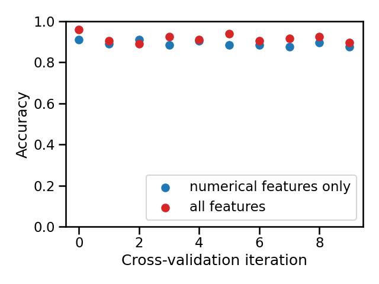

# 🏁 Wrap-up quiz 1

**This quiz requires some programming to be answered.**

Open the dataset `ames_housing_no_missing.csv` with the following command:

```python
import pandas as pd
ames_housing = pd.read_csv("../datasets/ames_housing_no_missing.csv")

target_name = "SalePrice"
data, target = ames_housing.drop(columns=target_name), ames_housing[target_name]
target = (target > 200_000).astype(int)
```

`ames_housing` is a pandas dataframe. The column "SalePrice" contains the
target variable.

We did not encounter any regression problem yet. Therefore, we convert the
regression target into a classification target to predict whether or not an
house is expensive. "Expensive" is defined as a sale price greater than
$200,000.

```{admonition} Question
Use the `data.info()` and ` data.head()` commands to examine the columns of
the dataframe. The dataset contains:

- a) only numerical features
- b) only categorical features
- c) both numerical and categorical features

_Select a single answer_
```

+++

```{admonition} Question
How many features are available to predict whether or not a house is
expensive?

- a) 79
- b) 80
- c) 81

_Select a single answer_
```

+++

```{admonition} Question
How many features are represented with numbers?

- a) 0
- b) 36
- c) 42
- d) 79

_Select a single answer_

Hint: you can use the method
[`df.select_dtypes`](https://pandas.pydata.org/pandas-docs/stable/reference/api/pandas.DataFrame.select_dtypes.html)
or the function
[`sklearn.compose.make_column_selector`](https://scikit-learn.org/stable/modules/generated/sklearn.compose.make_column_selector.html)
as shown in a previous notebook.
```

+++

Refer to the [dataset description](https://www.openml.org/d/42165) regarding
the meaning of the dataset.

```{admonition} Question
Among the following columns, which columns express a quantitative numerical
value (excluding ordinal categories)?

- a) "LotFrontage"
- b) "LotArea"
- c) "OverallQual"
- d) "OverallCond"
- e) "YearBuilt"

_Select all answers that apply_
```

+++

We consider the following numerical columns:

```python
numerical_features = [
  "LotFrontage", "LotArea", "MasVnrArea", "BsmtFinSF1", "BsmtFinSF2",
  "BsmtUnfSF", "TotalBsmtSF", "1stFlrSF", "2ndFlrSF", "LowQualFinSF",
  "GrLivArea", "BedroomAbvGr", "KitchenAbvGr", "TotRmsAbvGrd", "Fireplaces",
  "GarageCars", "GarageArea", "WoodDeckSF", "OpenPorchSF", "EnclosedPorch",
  "3SsnPorch", "ScreenPorch", "PoolArea", "MiscVal",
]
```

Now create a predictive model that uses these numerical columns as input data.
Your predictive model should be a pipeline composed of a
[`sklearn.preprocessing.StandardScaler`](https://scikit-learn.org/stable/modules/generated/sklearn.preprocessing.StandardScaler.html)
to scale these numerical data and a
[`sklearn.linear_model.LogisticRegression`](https://scikit-learn.org/stable/modules/generated/sklearn.linear_model.LogisticRegression.html).

```{admonition} Question
What is the accuracy score obtained by 10-fold cross-validation (you can set
the parameter `cv=10` when calling `cross_validate`) of this pipeline?

- a) ~0.5
- b) ~0.7
- c) ~0.9

_Select a single answer_
```

+++

Instead of solely using the numerical columns, let us build a pipeline that
can process both the numerical and categorical features together as follows:

- the `numerical_features` (as defined above) should be processed as previously
  done with a `StandardScaler`;
- the left-out columns should be treated as categorical variables using a
  [`sklearn.preprocessing.OneHotEncoder`](https://scikit-learn.org/stable/modules/generated/sklearn.preprocessing.OneHotEncoder.html).
  To avoid any issue with rare categories that could only be present during
  the prediction, you can pass the parameter `handle_unknown="ignore"` to the
  `OneHotEncoder`.

```{admonition} Question
What is the accuracy score obtained by 10-fold cross-validation of the pipeline
using both the numerical and categorical features?

- a) ~0.7
- b) ~0.9
- c) ~1.0

_Select a single answer_
```

+++

One way to compare two models is by comparing their means, but small differences
in performance measures might easily turn out to be merely by chance (e.g.
when using random resampling during cross-validation), and not because one
model predicts systematically better than the other.

Another way is to compare cross-validation test scores of both models
fold-to-fold, i.e. counting the number of folds where one model has a better
test score than the other. This provides some extra information: are some
partitions of the data making the classification task particularly easy or hard
for both models?

Let's visualize the second approach.



```{admonition} Question
Compare both models by counting on how many folds the model using all features
has a better test score than the other. Select the correct statement:

- a) [0, 3]: the model using all features is consistently worse
- b) [4, 6]: both models are almost equivalent
- c) [7, 10]: the model using all features is consistently better


_Select a single answer_
```

+++

```{note}
It is normal for this module to take longer than expected for people who are
discovering Python programming, but don't get discouraged! The programming
mechanisms will come with experience and the programming exercises in the
following modules will seem more and more natural as time goes by.
```
