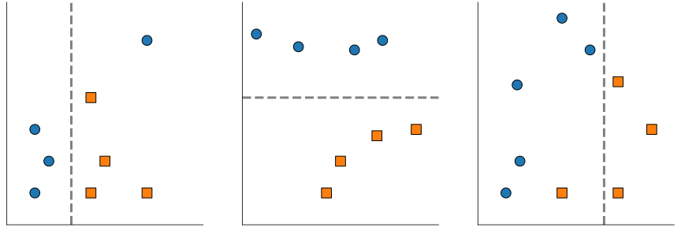

class: titlepage

.header[MOOC Machine learning with scikit-learn]

# Ensemble of tree-based models

Combine many decision trees into powerful models!

Bagging and Random Forests

Boosting and Gradient Boosting

For classification and regression


---

# Part 1: bagging and random forests

---

# Bagging for classification

.pull-left[]
.pull-right[]

???
Here we have a classification task: separating circles from squares.

---

# Bagging for classification

.pull-left[]
.pull-right[]

.pull-right[]


???

---

# Bagging for classification

.pull-left[]
.pull-right[]

.pull-right[]

.pull-right[]

--
.width65.shift-up-less.centered[
```python
from sklearn.ensemble import BaggingClassifier
from sklearn.ensemble import RandomForestClassifier
```
]

---

# Bagging for classification

.pull-left[]
.pull-right[]

.pull-right[]

.width65.shift-up-less.centered[
```python
from sklearn.ensemble import BaggingClassifier
from sklearn.ensemble import RandomForestClassifier
```
]


---

# Bagging for regression


---
class: split-50
# Bagging for regression

.shift-up-less[

]

.column1[
- Select multiple random subsets of the data
]

---
class: split-50
# Bagging for regression

.shift-up-less[

]

.column1[
- Select multiple random subsets of the data
- Fit one model on each
]

---
class: split-50
# Bagging for regression

.shift-up-less[

]

.column1[
- Select multiple random subsets of the data
- Fit one model on each
- Average predictions
]

.column2.center[

]

???

In bagging, we will construct deep trees independently of one another.

Each tree will be fitted on a sub-sampling from the initial data. i.e. we will
only consider a random part of the data to build each model.

When we have to classify a new point, we will aggregate the predictions of all
models in the ensemble with a voting scheme.

Each deep tree overfits, but voting makes it possible to cancel out some of the
training set noise. The ensemble overfits less than the individual models.

---
# Bagging versus Random Forests

**Bagging** is a general strategy
- Can work with any base model (linear, trees...)

--

**Random Forests** are bagged *randomized* decision trees
- At each split: a random subset of features are selected
--

- The best split is taken among the restricted subset

--
- Extra randomization decorrelates the prediction errors

--
- Uncorrelated errors make bagging work better

???

It's fine to use deep trees (`max_depth=None`) in random forests because of the
reduced overfitting effect of prediction averaging.

The more trees the better, typical to use 100 trees or more.

Diminishing returns when increasing the number of trees.

More trees: longer to fit, slower to predict and bigger models to deploy.

---

# Take away

**Bagging** and **random forests** fit trees **independently**
- each **deep tree overfits** individually
- averaging the tree predictions **reduces overfitting**
