class: titlepage

.header[MOOC Machine learning with scikit-learn]

# Bias and Variance

A statistical view of Underfitting and Overfitting.

???

In this lecture, we will discuss the bias-variance tradeoff, which is
useful to give a statistical view on underfitting and overfitting.

---
# Resampling the training set

- A limited amount of training data

- Training set is a small random subset of all possible observations

- What is the impact of this choice of training set on the learned prediction
  function?

???
Machine learning operates with finite training set:

We label an arbitrarily random subset of all possible observations because
labeling all the possible observations would be too costly.

What if we used a different training set?

- How different would the resulting learned prediction functions be?

- What would be their average test error?

---
# Overfit: variance

.pull-left.shift-left[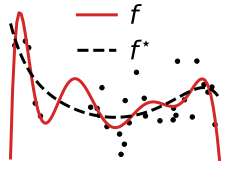]

.pull-right.width50.shift-left[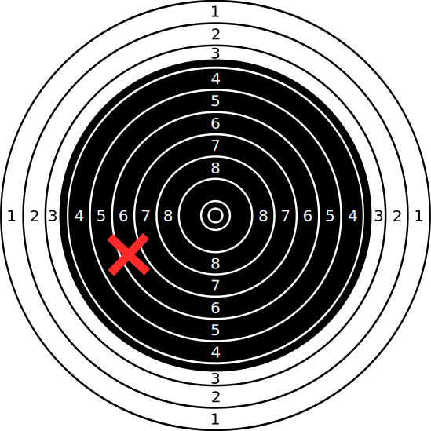]

???
Let's illustrate the concept of bias using the analogy of shooting arrows on a
target.

A cross on the target represents the result a model obtained by applying
the learning algorithm to a random training set with a given finite size.

The perfect model would be located at the center of the target. The distance to
the target represents the test error (computed with an infinite test data).

---
# Overfit: variance

.pull-left.shift-left[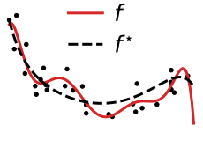]

.pull-right.width50.shift-left[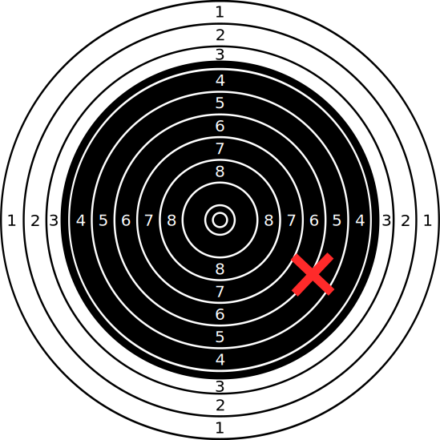]

???
If we were to train our high flexibility degree 9 polynomial model on an
alternative sample of the training set, we could get a very different
prediction function.

On the target, that would be represented an arrow in a completely
different location.

---
# Overfit: variance

.pull-left.shift-left[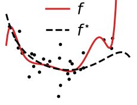]

.pull-right.width50.shift-left[]

???
Another resample, another very different prediction function.

---
# Overfit: variance

.pull-left.shift-left[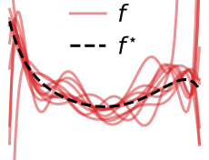]

.pull-right.width50.shift-left[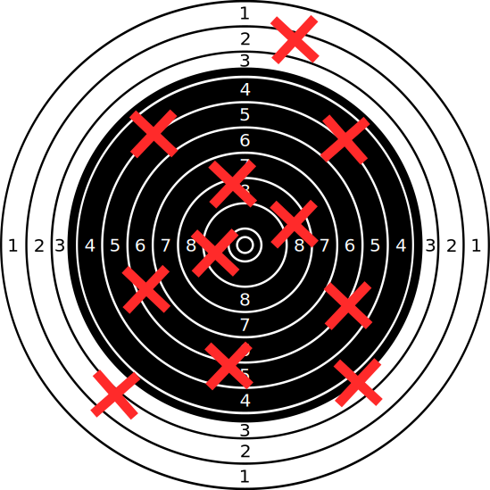]

???
If we consider all the possible models trained on resampled training sets we
can see the overfitting behavior.

The overfitting problem is one of variance: on average, the predictions are not
necessarily off, but each tend to fall far from the target. This can be seen by
their large spread around the best possible prediction. A useful mental picture
is that of the spread of arrows on a target.

For our machine learning example, this situation corresponds to a high
complexity model class that is affected by how the noise in the data generating
process makes the observations vary from one small training set to another.

---
# Underfit: bias

.pull-left.shift-left[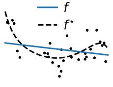]

.pull-right.width50.shift-left[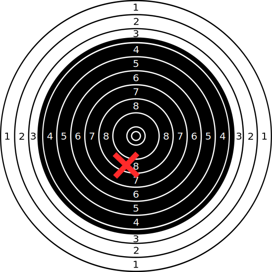]

???
Let's now consider an underfitting model: polynomial of degree 1 (which is just
a linear prediction function).

Since the true generative process is non-linear, our fitted prediction function
is bound to make prediction errors for some regions of the input space.

---
# Underfit: bias

.pull-left.shift-left[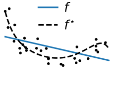]

.pull-right.width50.shift-left[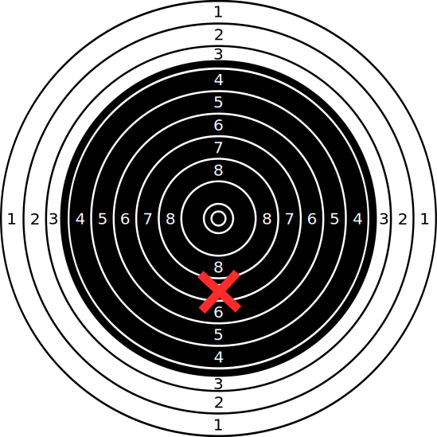]

???
Upon resampling the training set, one can see that the resulting training
function stays very similar: the slope moves a bit.

---
# Underfit: bias

.pull-left.shift-left[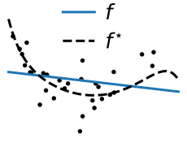]

.pull-right.width50.shift-left[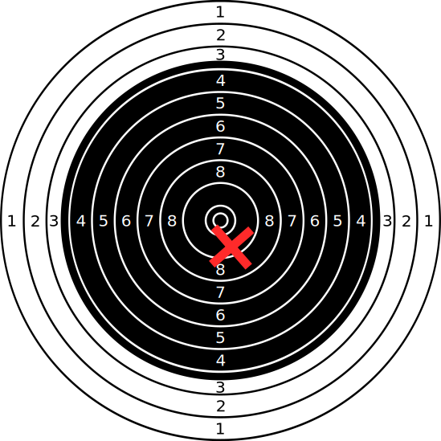]

???
Even more importantly, for a given region of the input space, the underfitting
models tend to make similar kinds of prediction errors.

---
# Underfit: bias

.pull-left.shift-left[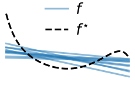]

.pull-right.width50.shift-left[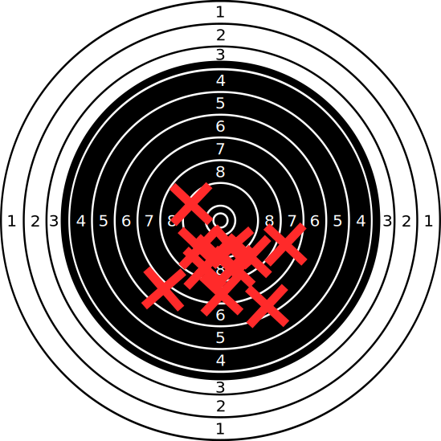]

???
Underfitting leads to systematic biases: the predictions cannot be on target on
average, because the model that we used to predict is systematically off the
data-generating process.

On the figure on the left, if we choose a linear model with generated data
coming from a non-linear generative process, whatever the choice of the training
set, our trained model will tend to make systematic under-predictions on the
edges of the domain and over-predictions in the middle of the domain.

---
# Underfit versus overfit

.pull-left.width50[]
.pull-right.width50.shift-left[]

.shift-up.pull-left.shift-left[.centered.reversed[Bias]]
.shift-up.pull-right.width50[.centered.reversed[Variance]]

???

This bias-variance tradeoff is classic in statistics. Often, adding a
little bit of bias helps reducing the variance. For instance, as with
throwing darts at a target, throwing the darts less strong might
lead to being below the target on average, but with less scatter.

---
# The bias-variance decomposition of the Mean Squared Error (MSE)

For people with a background in mathematics and statistics who are interested in
a more formal treatment of those concepts:

.center[
	[Decomposition of the squared prediction error on Wikipedia](
		https://en.wikipedia.org/wiki/Bias%E2%80%93variance_tradeoff)
]

*Note that the MOOC evaluation does not require you to understand
the mathematical details, only the general intuition.*

???

The irreducible error is a synonym for the Bayes error we introduced previously.

---
.center[
# Take home messages
]

**High bias** == **underfitting**:

.tight[
- systematic prediction errors
- the model prefers to ignore some aspects of the data
- mispecified models
]

**High variance** == **overfitting**:

.tight[
- prediction errors without obvious structure
- small change in the training set, large change in model
- unstable models
]

The bias can come from the choice of the model family.
