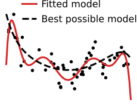
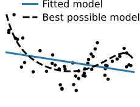

class: titlepage

.header[MOOC Machine learning with scikit-learn]

# Bias and Variance

A statistical view of Underfitting and Overfitting.

---
# Resampling the training set

- Limited amount of training data

- Training set is a small random subset of all possible observations

- What is the impact of this choice of training set on the learned prediction
  function?

???
Machine learning operates with finite training set:

We label an arbitrarily random subset of all possible observations because
labeling all the possible observations would be too costly.

What if we used a different training set?

- How different would be the resulting learned prediction functions?

- What would be their average test error?

---
# Overfit: variance

.pull-left.shift-left[]

.pull-right.width50.shift-left[]

???
Let's illustrate the concept of biais using the analogy of shooting arrows on a
target.

Each cross on the target represents the model obtained by applying the learning
algorithm to a random training set with a given finite size.

The perfect model would be located at the center of the target. The distance to
the target represent the test error (computed with an infinite test data).

The problem of overfit is one of variance: on average, the predictions are not
necessarily off, but each tends to fall far from the target. This can be seen by
their large spread around the best possible prediction. A useful mental picture
is that of the spread of arrows on a target.

For our machine learning example, this situation corresponds to a high
complexity model class that is affected by how the noise in the data generating
process makes the observations vary from one small training set to an other.

---
# Underfit: bias

.pull-left.shift-left[]

.pull-right.width50.shift-left[]

???
Underfitting leads to systematic biases: the predictions cannot be on target on
average, because the model that we use to predict is systematically off the
data-generating process.

On the figure of the left, if we choose a linear model but the generated data
comes from a non-linear generative process, whatever the choice of the training
set, our trained model will tend to make systematic under prediction on the
edges of the domain and over-prediction in the middle of the domain.

---
# Underfit versus overfit

.pull-left.width50[]
.pull-right.width50.shift-left[]

.shift-up.pull-left.shift-left[.centered.reversed[Bias]]
.shift-up.pull-right.width50[.centered.reversed[Variance]]

???

This bias-variance tradeoff is classic in statistics. Often, adding a
little bit of bias helps reducing the variance. For instance, as with
throwing darts at a target, where throwing the darts less strong might
lead to being below the target on average, but with less scatter.

---
# The bias-variance decomposition of the Mean Squared Error (MSE)

For people with a background in mathematics and statistics who are interested in
a more formal treatment of those concepts:

.center[
	[Decomposition of the squared prediction error on Wikipedia](
		https://en.wikipedia.org/wiki/Bias%E2%80%93variance_tradeoff)
]

*Note that the MOOC evaluation does not require you to understand
the mathematical details, only the general intuition.*

???

The irreducible error is a synonym for the Bayes error we introduced previously.

---
.center[
# Take home messages
]

**High bias** == **underfitting**:

.tight[
- systematic prediction errors
- the model prefers to ignore some aspects of the data
- mispecified models
]

**High variance** == **overfitting**:

.tight[
- prediction errors without obvious structure
- small change in the training set, large change in model
- unstable models
]

The bias can come from the choice of the model family.
