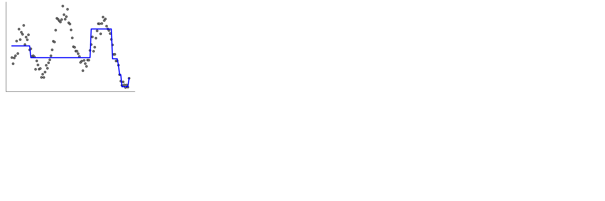
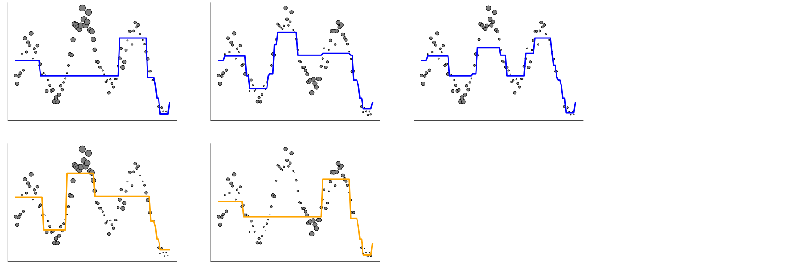

class: titlepage

.header[MOOC Machine learning with scikit-learn]

# Ensemble of tree-based models

## Part 2: boosting and gradient boosting

---

# Boosting for classification

.pull-left[]

---

# Boosting for classification

.pull-left[]
.pull-right[]

???
A first shallow tree starts to separate circles from squares.
Mistakes done by this first tree model shall be corrected
by a second tree model.

---
# Boosting for classification

.pull-left[]
.pull-right[]

???
So now, the second tree refines the first tree.
The final model is a weighted sum of these two trees.

---
# Boosting for classification

.pull-left[]
.pull-right[]

???

Ensembling via boosting makes it possible to progressively refine the
predictions of the previous model.

At each step we focus on mistakes of the previous model to correct them.

Even if the first models are underfitting (shallow trees), adding more trees
makes it possible to perfectly classify all the training set data points.

---

# Boosting for regression

---

# Boosting for regression

---

# Boosting for regression

---

# Boosting for regression

---

# Boosting for regression

---

# Boosting for regression

---

# Boosting for regression

---

# Boosting for regression

---

# Boosting for regression

---

# Boosting for regression

---

# Boosting vs Gradient Boosting

**Traditional Boosting**
.small[`sklearn.ensemble.AdaBoostClassifier`]
- Mispredicted **samples are re-weighted** at each step
- Can use any base model that accepts `sample_weight`

--

**Gradient Boosting**
.small[`sklearn.ensemble.HistGradientBoostingClassifier`]
- Each base model predicts the **negative error** of previous models
- `sklearn` use decision trees as the base model

???

In practice, gradient boosting is more flexible thanks to the use of cost
functions and tend to exhibits better predictive performance than traditional
boosting.

---
# Gradient Boosting and binned features

- `sklearn.ensemble.GradientBoostingClassifier`
  - Implementation of the traditional (exact) method
  - Fine for small data sets
  - Too slow for `n_samples` > 10,000

--

- `sklearn.ensemble.HistGradientBoostingClassifier`
  - Discretize numerical features (256 levels)
  - Efficient multi core implementation
  - **Much, much faster** when `n_samples` is large

???
Like traditional decision trees `GradientBoostingClassifier` and
`GradientBoostingRegressor` internally rely on sorting the features values
which as an `n * log(n)` time complexity and is therefore not suitable for
large training set.

`HistGradientBoostingClassifier` and `HistGradientBoostingRegressor` use
histograms to approximate feature sorting to find the best feature split
thresholds and can therefore be trained efficiently on datasets with hundreds
of features and tens of millions of data points.

Furthermore they can benefit from running on machines with many CPU cores very
efficiently.

---

# Take away

**Bagging**  | **Boosting**
------------ | -------------
fit trees **independently** | fit trees **sequentially**
each **deep tree overfits** | each **shallow tree underfits**
averaging the tree predictions **reduces overfitting** | sequentially adding trees **reduces underfitting**

**Gradient boosting** tends to perform slightly better than **bagging** and
**random forest**. Furthermore, shallow trees predict faster.
