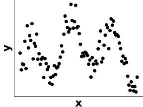
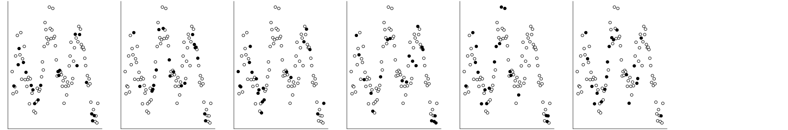
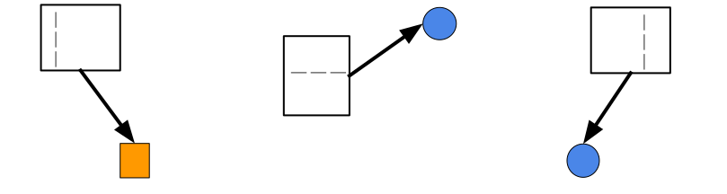
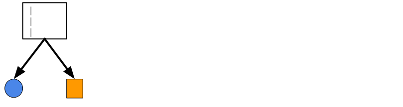
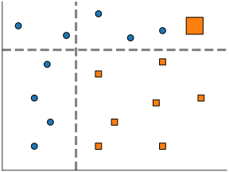

class: titlepage

.header[MOOC Machine learning with scikit-learn]

# Ensemble of tree-based models

This lesson covers models based on the aggregation of decision trees.
They are known as gradient-boosting and random forest

These are robust models for both regression and classification.


???
Decision trees are built as a set of rules for both 
classification and regression problems.

These are the building blocks for more elaborate model such 
as *random forest* and *gradient boosting trees*, as we will see.

---

# Outline

- Bagging
- Boosting

---

# Bagging



---

# Bagging

.shift-up-less[

]
.pull-left[

- Select multiple random subsets of the data
  ]

---

# Bagging

.shift-up-less[

]

.pull-left[

- Select multiple random subsets of the data

- Fit one model on each
  ]

---

# Bagging

.shift-up-less[

]

.pull-left[

- Select multiple random subsets of the data

- Fit one model on each

- Average predictions
  ]

.pull-right[

]

???

In bagging, we will construct deep trees in parallel.

Each tree will be fitted on a sub-sampling from the initial data.
i.e. we will only consider a random part of the data to build each model.

When we have to classify a new point, we will aggregate the prediction of every model by a voting scheme.

---

# Bagging trees: random forests

.pull-left[]
.pull-right[]

.width65.shift-up-less.centered[

```python
from sklearn.ensemble import RandomForestClassifier
```

]

???
Here we have a classification task: separating circles from squares.

---

# Bagging trees: random forests

.pull-left[]
.pull-right[]

.pull-right[]

.width65.shift-up-less.centered[

```python
from sklearn.ensemble import RandomForestClassifier
```

]

???

---

# Bagging trees: random forests

.pull-left[]
.pull-right[]

.pull-right[]

.pull-right[]

.width65.shift-up-less.centered[

```python
from sklearn.ensemble import RandomForestClassifier
```

]

???

---

# Boosting

## 

# Boosting

## 

# Boosting

## 

# Boosting

## 

# Boosting

## 

# Boosting

## 

# Boosting

## 

# Boosting

## 

# Boosting

## 

# Boosting


???

---

# Boosting

.pull-left[]

???

---

# Boosting

.pull-left[]
.pull-right[]

???
A first shallow tree starts to separate circles from squares. 
Mistakes done by this first tree model shall be corrected 
by a second tree model.

---

# Boosting

.pull-left[]
.pull-right[]

.width65.shift-up-less.centered[

```python
from sklearn.ensemble import HistGradientBoostingClassifier
clf = HistGradientBoostingClassifier(learning_rate = .1)
```

]

???
So now, the second tree refines the first tree. 
The final model is a weighted sum of these two trees.

---

# Boosting

.pull-left[]
.pull-right[]

.width65.shift-up-less.centered[

```python
from sklearn.ensemble import HistGradientBoostingClassifier
clf = HistGradientBoostingClassifier(learning_rate = .1)
```

]

???
We could continue to refining our ensemble model. 
At each step we focus on mistakes of the previous model.

---

# Take away

- `boosting` fits sequentially shallow trees
- `bagging` fits simultaneously deep trees
