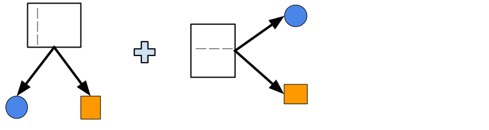

class: titlepage

.header[MOOC Machine learning with scikit-learn]

# Ensemble of tree-based models

Combine many decision trees into powerful models!

Gradient-boosting and random forests

For classification and regression


---

# Outline

- Bagging and Random Forests
- Boosting and Gradient Boosting

---

# Bagging for classification

.pull-left[]
.pull-right[]

???
Here we have a classification task: separating circles from squares.

---

# Bagging for classification

.pull-left[]
.pull-right[]

.pull-right[]


???

---

# Bagging for classification

.pull-left[]
.pull-right[]

.pull-right[]

.pull-right[]

--
.width65.shift-up-less.centered[
```python
from sklearn.ensemble import BaggingClassifier
from sklearn.ensemble import RandomForestClassifier
```
]

---

# Bagging for classification

.pull-left[]
.pull-right[]

.pull-right[]

.width65.shift-up-less.centered[
```python
from sklearn.ensemble import BaggingClassifier
from sklearn.ensemble import RandomForestClassifier
```
]


---

# Bagging for regression


---
class: split-50
# Bagging for regression

.shift-up-less[

]

.column1[
- Select multiple random subsets of the data
]

---
class: split-50
# Bagging for regression

.shift-up-less[

]

.column1[
- Select multiple random subsets of the data
- Fit one model on each
]

---
class: split-50
# Bagging for regression

.shift-up-less[

]

.column1[
- Select multiple random subsets of the data
- Fit one model on each
- Average predictions
]

.column2.center[

]

???

In bagging, we will construct deep trees independently of one another.

Each tree will be fitted on a sub-sampling from the initial data. i.e. we will
only consider a random part of the data to build each model.

When we have to classify a new point, we will aggregate the predictions of all
models in the ensemble with a voting scheme.

Each deep tree overfits, but voting makes it possible to cancel out some of the
training set noise. The ensemble overfits less than the individual models.

---
# Bagging versus Random Forests

**Bagging** is a general strategy
- Can work with any base model (linear, trees...)

--

**Random Forests** are bagged *randomized* decision trees
- At each split: a random subset of features are selected
--

- The best split is taken among the restricted subset

--
- Extra randomization decorrelates the prediction errors

--
- Uncorrelated errors make bagging work better

???

It's fine to use deep trees (`max_depth=None`) in random forests because of the
reduced overfitting effect of prediction averaging.

The more trees the better, typical to use 100 trees or more.

Diminishing returns when increasing the number of trees.

More trees: longer to fit, slower to predict and bigger models to deploy.

---
# Boosting for classification

.pull-left[]

---

# Boosting for classification

.pull-left[]
.pull-right[]

???
A first shallow tree starts to separate circles from squares.
Mistakes done by this first tree model shall be corrected
by a second tree model.

---
# Boosting for classification

.pull-left[]
.pull-right[]

???
So now, the second tree refines the first tree.
The final model is a weighted sum of these two trees.

---
# Boosting for classification

.pull-left[]
.pull-right[]

???

Ensembling via boosting makes it possible to progressively refine the
predictions of the previous model.

At each step we focus on mistakes of the previous model to correct them.

Even if the first models are underfitting (shallow trees), adding more trees
makes it possible to perfectly classify all the training set data points.

---

# Boosting for regression


---

# Boosting for regression


---

# Boosting for regression


---

# Boosting for regression


---

# Boosting for regression


---

# Boosting for regression


---

# Boosting for regression


---

# Boosting for regression


---

# Boosting for regression


---

# Boosting for regression


---

# Boosting vs Gradient Boosting

**Traditional Boosting**
.small[`sklearn.ensemble.AdaBoostClassifier`]
- Mispredicted **samples are re-weighted** at each step
- Can use any base model that accepts `sample_weight`

--

**Gradient Boosting**
.small[`sklearn.ensemble.HistGradientBoostingClassifier`]
- Each base model predicts the **negative error** of previous models
- `sklearn` use decision trees as the base model


???

In practice, gradient boosting is more flexible thanks to the use of cost
functions and tend to exhibits better predictive performance than traditional
boosting.

---
# Gradient Boosting and binned features

- `sklearn.ensemble.GradientBoostingClassifier`
  - Implementation of the traditional (exact) method 
  - Fine for small data sets
  - Too slow for `n_samples` > 10,000

--

- `sklearn.ensemble.HistGradientBoostingClassifier`
  - Discretize numerical features (256 levels)
  - Efficient multi core implementation
  - **Much, much faster** when `n_samples` is large

???
Like traditional decision trees `GradientBoostingClassifier` and
`GradientBoostingRegressor` internally rely on sorting the features values
which as an `n * log(n)` time complexity and is therefore not suitable for
large training set.

`HistGradientBoostingClassifier` and `HistGradientBoostingRegressor` use
histograms to approximate feature sorting to find the best feature split
thresholds and can therefore be trained efficiently on datasets with hundreds
of features and tens of millions of data points.

Furthermore they can benefit from running on machines with many CPU cores very
efficiently.

---

# Take away

- **Bagging** and **random forests** fit trees **independently**
  + each **deep tree overfits** individually
  + averaging the tree predictions **reduces overfitting**

- (Gradient) **boosting** fits trees **sequentially**
  + each **shallow tree underfits** individually
  + sequentially adding trees **reduces underfitting**

- **Gradient boosting** tends to perform slightly better than **bagging** and
  **random forest** and furthermore shallow trees predict faster.
