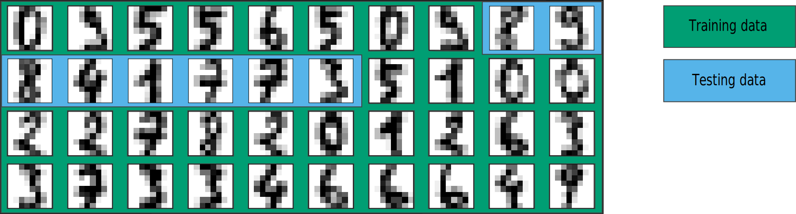

class: titlepage

.header[MOOC Machine learning with scikit-learn]

# Validation of a model

Train-test split and cross-validation


???

In this lecture, we will discuss the use of a train-test split and motivate
the use of cross-validation for evaluating the generalization performance of
a model.


---
# Full dataset

```python
from sklearn.datasets import load_digits

digits = load_digits()
data = digits.images[30:70].reshape((4, 10, -1))
```

.center[]

Goal: To evaluate the **generalization performance** of a model.

???

You can use the following snippet of code to visualize the data defined in this slide

```python
import matplotlib.pyplot as plt

fig, ax = plt.subplots(5, 10, figsize=(18, 8),
                       subplot_kw=dict(xticks=[], yticks=[]))
for j in range(10):
    ax[4, j].set_visible(False)
    for i in range(4):
        im = ax[i, j].imshow(data[i, j].reshape((8, 8)),
                             cmap=plt.cm.binary, interpolation='nearest')
        im.set_clim(0, 16)

plt.show()
```

---
# Train-test split

```python
from sklearn.model_selection import train_test_split

X_train, X_test, y_train, y_test = train_test_split(
    data, target, test_size=0.2, shuffle=False)
```

.center[]

The test accuracy using a `LogisticRegression()` is 0.875

???

The following snippet of code plots the testing set of the train-test split defined in this slide

```python
fig, axes = plt.subplots(nrows=1, ncols=8, figsize=(18, 8))
fig.suptitle("Test set for train_test_split with shuffle=False", fontsize=16, y=0.65)

for ax, image in zip(axes, X_test):
    ax.set_axis_off()
    image = image.reshape(8, 8)
    ax.imshow(image, cmap=plt.cm.gray_r, interpolation='nearest')
```

---

# Train-test split

```python
from sklearn.model_selection import train_test_split

X_train, X_test, y_train, y_test = train_test_split(
    data, target, test_size=0.2, random_state=0, shuffle=True)
```

.center[]

The test accuracy using a `LogisticRegression()` is 1.000

???

The following snippet of code plots the testing set of the train-test split defined
in this slide

```python
fig, axes = plt.subplots(nrows=1, ncols=8, figsize=(18, 8))
fig.suptitle("Test set for train_test_split with shuffle=False", fontsize=16, y=0.65)

for ax, image in zip(axes, X_test):
    ax.set_axis_off()
    image = image.reshape(8, 8)
    ax.imshow(image, cmap=plt.cm.gray_r, interpolation='nearest')
```

---

# Train-test split


.tight[
- In general, the score of a model depends on the split:
    - the train-test proportion
    - the representativeness of the elements in each set
]
.tight[
- A more systematic way of evaluating the generalization performance of a model is
through cross-validation
]
.tight[
- Cross-validation consists of repeating the split such that the training and
testing sets are different for each evaluation. 
]


---
# Cross-validation

```python
from sklearn.model_selection import KFold

cv = KFold(n_splits=5, shuffle=False)
```

.center[Fold 1]

.center[]

The test accuracy in this fold is 0.625

???

The default parameter values for`KFold` are `n_splits=5` and `shuffle=False`,
meaning that `cv = KFold(n_splits=5, shuffle=False)` is equivalent to `cv = KFold()`


---
# Cross-validation

```python
from sklearn.model_selection import KFold

cv = KFold(n_splits=5, shuffle=False)
```

.center[Fold 2]

.center[]

The test accuracy in this fold is 0.750

???

The default parameter values for`KFold` are `n_splits=5` and `shuffle=False`,
meaning that `cv = KFold(n_splits=5, shuffle=False)` is equivalent to `cv = KFold()`

---
# Cross-validation

```python
from sklearn.model_selection import KFold

cv = KFold(n_splits=5, shuffle=False)
```

.center[Fold 3]

.center[]

The test accuracy in this fold is 1.000

???

The default parameter values for`KFold` are `n_splits=5` and `shuffle=False`,
meaning that `cv = KFold(n_splits=5, shuffle=False)` is equivalent to `cv = KFold()`

---
# Cross-validation

```python
from sklearn.model_selection import KFold

cv = KFold(n_splits=5, shuffle=False)
```

.center[Fold 4]

.center[]

The test accuracy in this fold is 1.000

???

The default parameter values for`KFold` are `n_splits=5` and `shuffle=False`,
meaning that `cv = KFold(n_splits=5, shuffle=False)` is equivalent to `cv = KFold()`

---
# Cross-validation

```python
from sklearn.model_selection import KFold

cv = KFold(n_splits=5, shuffle=False)
```

.center[Fold 5]

.center[]

The test accuracy in this fold is 0.875

???

The default parameter values for`KFold` are `n_splits=5` and `shuffle=False`,
meaning that `cv = KFold(n_splits=5, shuffle=False)` is equivalent to `cv = KFold()`

---

class: split-60
# Score variability

```python
from sklearn.model_selection import cross_val_score

cv = KFold(n_splits=5, shuffle=False)
test_scores = cross_val_score(model, data, target, cv=cv)
```

.column1.pull-left.shift-up-less[]

.column2[The average accuracy is 0.85 ± 0.15]

???

The following snippet of code plots the scores as shown in this slide

```python
df = pd.DataFrame ({
        'Group':  ['Fold 1', 'Fold 2', 'Fold 3', 'Fold 4', 'Fold 5'],
        'Value': test_scores
})
mean = test_scores.mean()
std = test_scores.std()

fig,ax = plt.subplots()

plt.barh(y=df.Group, width=df.Value, edgecolor="black")
plt.xlabel("Accuracy score")
ax.axvline(mean, color= "black", linewidth=4)
ax.axvline(mean-std, color= "black", linewidth=2, linestyle='--')
ax.axvline(mean+std, color= "black", linewidth=2, linestyle='--')
ax.invert_yaxis()

_ = plt.title("5-Fold cross-validation test scores")
```

---

# Cross-validation with `shuffle=True`

```python
from sklearn.model_selection import KFold

cv = KFold(n_splits=5, random_state=0, shuffle=True)
```

.center[Fold 1]

.center[]

The test accuracy in this fold is 1.000

???

Whenever randomization is part of a Scikit-learn algorithm, a `random_state` parameter
may be provided to control the random number generator used. Note that the mere presence
of `random_state` doesn’t mean that randomization is always used, as it may be dependent
on another parameter, e.g. `shuffle`, being set to `True`.

---

# Cross-validation with `shuffle=True`

```python
from sklearn.model_selection import KFold

cv = KFold(n_splits=5, random_state=0, shuffle=True)
```

.center[Fold 2]

.center[]

The test accuracy in this fold is 0.875

???

Whenever randomization is part of a Scikit-learn algorithm, a `random_state` parameter
may be provided to control the random number generator used. Note that the mere presence
of `random_state` doesn’t mean that randomization is always used, as it may be dependent
on another parameter, e.g. `shuffle`, being set to `True`.

---

# Cross-validation with `shuffle=True`

```python
from sklearn.model_selection import KFold

cv = KFold(n_splits=5, random_state=0, shuffle=True)
```

.center[Fold 3]

.center[]

The test accuracy in this fold is 1.000

???

Whenever randomization is part of a Scikit-learn algorithm, a `random_state` parameter
may be provided to control the random number generator used. Note that the mere presence
of `random_state` doesn’t mean that randomization is always used, as it may be dependent
on another parameter, e.g. `shuffle`, being set to `True`.

---

# Cross-validation with `shuffle=True`

```python
from sklearn.model_selection import KFold

cv = KFold(n_splits=5, random_state=0, shuffle=True)
```

.center[Fold 4]

.center[]

The test accuracy in this fold is 0.75

???

Whenever randomization is part of a Scikit-learn algorithm, a `random_state` parameter
may be provided to control the random number generator used. Note that the mere presence
of `random_state` doesn’t mean that randomization is always used, as it may be dependent
on another parameter, e.g. `shuffle`, being set to `True`.

---

# Cross-validation with `shuffle=True`

```python
from sklearn.model_selection import KFold

cv = KFold(n_splits=5, random_state=0, shuffle=True)
```

.center[Fold 5]

.center[]

The test accuracy in this fold is 1.000

???

Whenever randomization is part of a Scikit-learn algorithm, a `random_state` parameter
may be provided to control the random number generator used. Note that the mere presence
of `random_state` doesn’t mean that randomization is always used, as it may be dependent
on another parameter, e.g. `shuffle`, being set to `True`.

---

# Cross-validation in scikit-learn

.tight[
- Other than `KFold`, scikit-learn provides several techniques for cross-validation
]

.tight[
- One example is `ShuffleSplit`, where the number of splits no longer determines the size
of the train and test sets.
]

---

# Cross-validation with `ShuffleSplit`

```python
from sklearn.model_selection import ShuffleSplit

cv = ShuffleSplit(n_splits=2, test_size=0.2, random_state=0)
```

.center[Fold 1]

.center[]

The test accuracy in this fold is 1.000

???

The `ShuffleSplit` strategy is equivalent to manually calling `train_test_split` many
times with different random states.

---

# Cross-validation with `ShuffleSplit`

```python
from sklearn.model_selection import ShuffleSplit

cv = ShuffleSplit(n_splits=2, test_size=0.2, random_state=0)
```

.center[Fold 1]

.center[]

The test accuracy in this fold is 1.000

???

The `ShuffleSplit` strategy is equivalent to manually calling `train_test_split` many
times with different random states.

---

# Cross-validation with `ShuffleSplit`

```python
from sklearn.model_selection import ShuffleSplit

cv = ShuffleSplit(n_splits=2, test_size=0.2, random_state=0)
```

.center[Fold 2]

.center[]

The test accuracy in this fold is 1.000

???

The `ShuffleSplit` strategy is equivalent to manually calling `train_test_split` many
times with different random states.

---


.center[
# Take home messages
]

**Full data**
.tight[
- should not be used for scoring a model
]

**Train-test split**:

.tight[
- evaluate the generalization performance on unseen data
]

**Cross-validation**:

.tight[
- evaluate the variability of our estimation of the generalization performance
]
