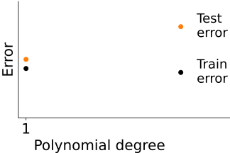
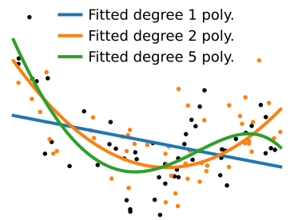
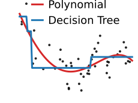

class: titlepage

.header[MOOC Machine learning with scikit-learn]

# Comparing train and test errors

Varying complexity: validation curves

Varying the sample size: learning curves

Goal: understand the overfitting / underfitting
trade-off

???

So, now that we understand that there is a tradeoff between underfitting and
overfitting, the question is: from a practical standpoint, how do we know on
which side of the balance our model is sitting?

---

# Train vs test error

.shift-left.pull-left[]
.width50.pull-right[
Measure:

- errors on test data (generalization)

- errors on the train data
  ]

???

To probe the tradeoff between underfit and overfit, our central
tool will be to measure both the generalization error, on unseen
test data, and the error on the data used to train the model.

---

# Train vs test error: increasing complexity

.shift-left.pull-left[]
.width50.pull-right[]

???

We can look at these errors while varying the model complexity.

If we start with a very simple model, the training error is similar to
the testing error: the model does not have enough capacity to capture
noise.

---

# Train vs test error: increasing complexity

.shift-left.pull-left[]
.width50.pull-right[]

???

As we increase model complexity, both the train and the test errors go
down: the model explains well the data, but does not capture noise yet.

---

# Train vs test error: increasing complexity

.shift-left.pull-left[]
.width50.pull-right[]

???

Even more complex models fit the training data better, but they start
capturing noise in their model fit. As a result, their error on the test
data is larger.

---

# Train vs test error: increasing complexity

.shift-left.pull-left[]
.width50.pull-right[]

???

As we keep increasing the model complexity, the training error keeps going down,
while the test increases sharply. The model is overfitting.

---

# Train vs test error: increasing complexity

.centered[.shift-left[]]

.shift-up.centered[
.reversed[Underfit]
.reversed[Sweet spot]
.reversed[Overfit]
]

???

The big picture is that models that are too simple have similar train and
test error, while models that are too complex have a small train error
but a very large test error. There is a sweet spot in the middle, and
this is where good machine-learning models lie.

---

class: center, middle

# Varying sample size

Learning curves

???

Another useful way to look at the tradeoff between underfit and overfit
is with varying sample size. Such an analysis is often known as a
learning curve.

---

# Varying sample size

.shift-left.pull-left[]
.width50.pull-right[]

.reversed[Overfit]

???

If we fit a polynomial of degree 9 on a small dataset, we will not have
enough data and we will be in an overfitting situation.
As a result the train error will be low, and the test error high.

---

# Varying sample size

.shift-left.pull-left[]
.width50.pull-right[]

???

As we increase the sample size, the test error decreases while
the train error increases: the model is overfitting less.

---

# Varying sample size

.shift-left.pull-left[]
.width50.pull-right[]

.reversed[Sweet spot?]

???

With enough data, the train and test errors converge: the model no
longer overfits.

---

# Varying sample size

.shift-left.pull-left[]
.width50.pull-right[]

.reversed[Diminishing returns]

???

After a while, we reach diminishing returns: the test and the train error
are no longer changing: adding more data does not bring any benefit.

--

Try more complex models?

???

Given that more data are not improving model prediction, it may be useful
to try more complex models.

---

# Bayes error rate

.shift-left.pull-left[]
.width50.pull-right[
The error of the best model trained on unlimited data.

Here, the data-generating process is a degree-9 polynomial

We cannot do better

Predictions limited by noise

]

???

In general, when adding more data does not provide improvements,
it is useful to try more complex models.

However, in the specific case of our example, the data-generating process
in a degree-9 polynomial. As a result, more complex models will not
improve the prediction: the present model has already captured all the
non-random link between _X_ and _y_.

The corresponding prediction is imperfect, yet, we cannot do better: the
prediction is limited by the intrinsic randomness of the link between X
and y.

---

class: middle

.center[

# Model families

]

.centered[
Crucial to match

.tight[

- statistical model

- data-generating process
  ]
  ]

.centered[So far: polynomials for both]

_Some family names: linear models, decision trees, random forests, kernel machines,
multi-layer perceptrons_

???

The excellent performance that we just observed for degree-9 polynomials
when there is plenty of data comes from the perfect match between the
statistical model used to analyze the data and the data-generating process.
So far, we have used polynomials for both of them, however in practice,
given some data, we seldom know a simple form of model in which the data is drawn.

For this reason, the choice of family of model is crucial.

Note that some of the most important model families will be presented in details
in the next modules.

---

# Different model families

.shift-left.pull-left[]
.pull-right.width[

- Different "inductive bias"

- Different notion of "complexity"
  ]

???

Different model families come with different forms of complexity and bias
(which we call inductive bias).

For instance, polynomial regressions tend to be smooth, and their
complexity is controlled by the degree of the polynomials used to fit the
data. On the other hand, decision trees are locally constant. Their
complexity is controlled by the number of constant regions that they fit.

---

# Different model families

.shift-left.pull-left[]
.pull-right[]

.shift-up.pull-left[.reversed[Simple variant]]
.shift-up.pull-right[.reversed[Complex variant]]

.centered[⇦ regularization ⇦]

???

Varying model complexity for these different families of model explores
different underfit and overfit behavior.

In general, forcing a model towards a simpler fit is called
"regularization". In scikit-learn, and in machine learning in general,
almost every model comes with a specific regularization strategy. Part of
machine-learning practice is to understand the inductive biases and
the regularization strategy to choose the right model. We will cover this
later, as we explore various models.

---

.center[

# Take home messages

]

Models **overfit**:

.tight[

- number of examples in the training set is too small
- testing error is much bigger than training error
  ]

Models **underfit**:

.tight[

- models fail to capture the shape of the training set
- even the training error is large
  ]

Different model families = different complexity & inductive bias

???

Let me conclude this lesson by recapitulating the take home messages.

When the models are too complex for the data at hand, they overfit.
This means that they explain the data that they have seen too well as
they capture noise, and thus do not generalize to new data.

On the opposite, when models are too simple for the data at hand, they
underfit. This means that they capture no noise, but their ability to
generalize is then limited by their expressivity.

Comparing train and test error, for instance varying model complexity, or
amount of data, can reveal this tradeoff.

The notion of complexity, or the bias imposed by a model, are both
specific to a model family. We will later study different model families.
