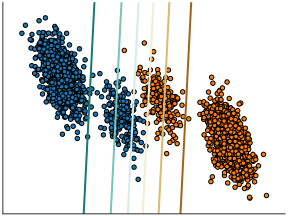

class: titlepage

.header[MOOC Machine learning with scikit-learn]

# Linear Model

This lesson covers the linear models. These are basic models, easy to understand and fast to train


???

Linear models are easy to understand and fast to train, 
they give us fair baselines


---
# Outline

* What is a linear model?
* Linear model for regression & classification
* How to avoid overfitting?


---
# Adult census

.very-small[

| Age | Workclass | Education    | Marital-status     | Occupation         | Relationship | Race  | Sex  | Capital-gain | Hours-per-week | Native-country | Salary |
| --- | --------- | ------------ | ------------------ | ------------------ | ------------ | ----- | ---- | ------------ | -------------- | -------------- | ----- |
| 25  | Private   | 11th         | Never-married      | Machine-op-inspct  | Own-child    | Black | Male | 0            | 40             | United-States  | $45k |
| 38  | Private   | HS-grad      | Married-civ-spouse | Farming-fishing    | Husband     | White  | Male | 0            | 50             | United-States   | $40k |
| 28  | Local-gov | Assoc-acdm   | Married-civ-spouse | Protective-serv    | Husband      | White | Male | 0            | 40             | United-States   | $60k  |
| 44  | Private   | Some-college | Married-civ-spouse | Machine-op-inspct  | Husband      | Black | Male | 7688         | 40             | United-States   | $52k  |

]
Salary = *.4 x* education + *.2 x* hours-per-week + *.1 x* age + ...

???
Adult census is here a bit modify, instead we have the value of the salary for every one.
So we can see it as a regression problem

Salary could be a linear combination of the feature (explanatory variable). 


---
# Linear regression

Predict the value of the target **y**  
given some observation **X**

.shift-down.pull-left.shift-left[]

???
For illustration purpose, let's consider one dimensionnal observation, 
e.g. salary should be explain by education level (nb of year of study)

---
# Linear regression
A linear model is a slope "as close as possible" from datapoint
The blue curve is the prediction for each **x**

.shift-down.pull-left.shift-left[]
.pull-right.very-small[```python
from sklearn.linear_model import LinearRegression
lin_reg = LinearRegression()
lin_reg.fit(x, y)
```]
???

We learn a linear function to predict *y*. Here the salary is a constant times the number of years of study.


---
# Linear regression

The linear regression objectif is to minimize the distance between the prediction curve and the datapoints

.shift-down.pull-left.shift-left[]

???
An error for each point correspond to the red bar in the figure
the best fit is the line which minimize the sum of (the square of) those red lines.

Fortunatly, there is a formula, given **X** and **y**, to find the optimal weights in an efficient manner

---
# Linear regerssion in higher dimension

.pull-left.shift-left[]


???
In real world data set, **X** has severals dimensions, and it is not possible anymore to represent it.

---
# Logistic regression

For **classification** we use a logistic regression model  
**y** is binary, either +1 or -1

.shift-left.pull-left[]
.pull-right.very-small[
```python
From sklearn.linear_model import LogisticRegression
log_reg = LogisticRegression()
```
]
???
Logistic regression is a linear model for **classification** - not regresion as the name suggest.

In our adult_census dataset, we do not have continous value for salary but only whether the salary is higher than $50K or not.


---
# Logistic regression

The output is now conposed with the logistic function
Logistic(x) = 1 / (1 + exp(-x))

.shift-left.pull-left[]
.pull-right.very-small[
```python
From sklearn.linear_model import LogisticRegression
log_reg = LogisticRegression()
log_reg.fit(X, y)
```]

---
# Logistic regression in 2 dimensions

**X** is 2-dimensional  
**y** is the color

.shift-left.pull-left[]
.pull-right[]

???
Here is an other way of representing our data.
In this case, X has two dimension x1 and x2.
The axis correspond to x1, x2
and the color correspond to the target label y 

---
# Model complexity
Salary = *.4 x* education_level + *.2 x* hours-per-week + *.1 x* age + 
.red[ *.2 x* zodiac_sign + *.1 x* red_socks] + ...  

* Linear model could also overfit. 
 - Reducing its complexity by reducing its parameters value is called *Ridge regression*
???

If we have too many parameters w.r.t. number of samples, it's adviced to penalize the parameters of our models.

With weights penalty, we include the value of the model's weights within the objectif function
So a penalized model should choose lower weights for almost a similar fit

The complexity parameter \alpha controls the amount of shrinkage: the larger the value of \alpha, the greater the amount of shrinkage and thus the coefficients become more robust to collinearity.

---
# Bias-variance tradeoff: an example


.pull-left.shift-left[]

---
# 2 points example


.pull-left.shift-left[]
.pull-right[]

.pull-left.shift-left[     Linear regression]
.pull-right[         Ridge]
.pull-left.shift-left[     No bias, high variance]
.pull-right[         low bias, low variance]
???
from http://scipy-lectures.org/packages/scikit-learn/index.html#bias-variance-trade-off-illustration-on-a-simple-regression-problem

Left: As we can see, our linear model captures and amplifies the noise in the data. It displays a lot of *variance*.

Right: Ridge estimator regularizes the coefficients by shrinking lightly them to zero

Ridge displays much less variance. However it systematically under-estimates the coefficient. It displays a *biased* behavior.

This is a typical example of bias/variance tradeof: non-regularized estimator are not biased, but they can display a lot of variance. Highly-regularized models have little variance, but high bias. This bias is not necessarily a bad thing: what matters is choosing the tradeoff between bias and variance that leads to the best prediction performance. For a specific dataset there is a sweet spot corresponding to the highest complexity that the data can support, depending on the amount of noise and of observations available.


---
# Logistic regression penalized
Logistic Regression comes with a penalty parameters C

.shift-left.pull-left[]
.pull-right[]
???
For large value of C, the model put more emphasize on the frontier's point. 
In contrary, for low value of C, the model is considering all the points.
The choice of C depends of the dataset

---
# Logistic regression for multiclass

Logistic regression could adapt even if **y** contains multiple classes. There are several options:

.shift-left.pull-left[]
.pull-right[
* Multinomial 
* One vs One
* One vs Rest
]
???
Mutlinomial logistic regression is a natural extension of logistic regression.
Otherwise, we stil can run One vs Rest approach.

---
# Linear separability


.shift-left.pull-left[]
.pull-right[]

.pull-left.shift-left[Linearly separable]
.pull-right[     linearly *Not* separable]

???
Linear models work as long as your data could be linearly separable.
Otherwise, either we could do features augmentation, or we could choose a more complex model.

---
.center[
# Take home messages 
]

* Linear model are good baselines for:
 - regression: linear regression + penalty = Ridge
 - classification: logistic regression

* very fast to train
* Better when *p* > *n*


???
