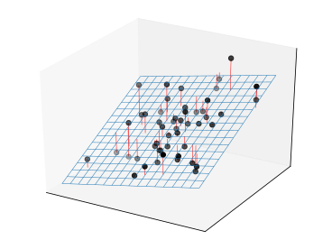
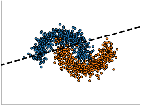

class: titlepage

.header[MOOC Machine learning with scikit-learn]

# Linear Model

This lesson covers the linear models. These are basic models, easy to
understand and fast to train.


???

Linear models are easy to understand and fast to train,
they give us fair baselines.


---
# Outline

* What is a linear model?
* Linear model for regression & classification
* How to avoid overfitting?


---
# Adult census

.very-small[

| Age | Workclass | Education    | Marital-status     | Occupation         | Relationship | Race  | Sex  | Capital-gain | Hours-per-week | Native-country | Salary |
| --- | --------- | ------------ | ------------------ | ------------------ | ------------ | ----- | ---- | ------------ | -------------- | -------------- | ----- |
| 25  | Private   | 11th         | Never-married      | Machine-op-inspct  | Own-child    | Black | Male | 0            | 40             | United-States  | $45k |
| 38  | Private   | HS-grad      | Married-civ-spouse | Farming-fishing    | Husband     | White  | Male | 0            | 50             | United-States   | $40k |
| 28  | Local-gov | Assoc-acdm   | Married-civ-spouse | Protective-serv    | Husband      | White | Male | 0            | 40             | United-States   | $60k  |
| 44  | Private   | Some-college | Married-civ-spouse | Machine-op-inspct  | Husband      | Black | Male | 7688         | 40             | United-States   | $52k  |

]
  
.small["Salary" = *0.4 x* "Education" + *0.2 x* "Hours-per-week" + *0.1 x* "Age" + ...]

???
Adult census is here a bit modify, instead of having 2 categories, < $50k and
>= $50k, the target "Salaray" contains the exact value of the salary for each
person. Thus, the target is continuous and we deal with a regression problem
instead of a classification problem.

Salary could be a linear combination of the feature (explanatory variable).


---
# Linear regression

Predict the value of the target **y**  
given some observation **X**

.shift-down.pull-left.shift-left[]

???
For illustration purpose, let's consider 1-dimensional observation,
e.g. salary should be explained by education level (number of year of study)

---
# Linear regression
A linear model is a slope "as close as possible" from all samples
The blue curve is the predictions for each possible **x**

.shift-down.pull-left.shift-left[]

  ```python
  from sklearn.linear_model import LinearRegression
  linear_regression = LinearRegression()
  linear_regression.fit(x, y)
```

???

We learn a linear function to predict *y*. Here, the salary is a constant
multiplied by the number of years of study.


---
# Linear regression

The linear regression aims at minimizing the distance between the prediction
curve and the samples

.shift-down.pull-left.shift-left[]


```python
  from sklearn.linear_model import LinearRegression
  linear_regression = LinearRegression()
  linear_regression.fit(x, y)

  y_pred = linear_regression.predict(X)
  residuals = y - y_pred
  error = sum(residuals ** 2)
```

???
An error for each sample corresponds to the red bar in the figure.
The best fit is the blue line which minimizes the sum of (the square of) those
red lines.

Fortunately, there is a formula, given **X** and **y**, to find the optimal
weights in an efficient manner.

---
# Linear regression in higher dimensions

.pull-left.shift-left[]


???
In higher dimensions, the principle remains the same: a linear model tries
to minimize the distance between the samples and a hyper-plane.

In real-world data set, **X** has several dimensions, and it is not anymore
possible to represent it graphically.

---
# For classification: logistic regression

For **classification**, we use a logistic regression model  
**y** is binary,
either +1 or -1

.shift-left.pull-left[]


 ```python
 From sklearn.linear_model import LogisticRegression
 log_reg = LogisticRegression()
 ```

???
Logistic regression is a linear model for **classification** - not regression
as the name would wrongly suggest.

In our `adult_census` dataset, we do not have continuous value for salary but
only whether the salary is higher than $50K or not. This problem is, therefore,
a classification problem.


---
# For classification: logistic regression

The output is now modelled as a form of a step function, which is adjusted on
the data

.shift-left.pull-left[]


 ```python
 From sklearn.linear_model import LogisticRegression
 log_reg = LogisticRegression()
 log_reg.fit(X, y)
 ```

---
# Logistic regression in 2 dimensions

**X** is 2-dimensional
**y** is the color

.shift-left.pull-left[]
.pull-right[]

???
Here is an other way of representing our data.
In this case, X has two dimension x1 and x2.
The axes correspond to x1, x2 and the color corresponds to the target label y.

---
# Model complexity


* A linear model can also overfit


.small["Salary" = *0.4 x* "Education" + *0.2 x* "Hours-per-week" + *0.1 x* "Age" +]  
.small.red[&nbsp; &nbsp; &nbsp; &nbsp; &nbsp; &nbsp; &nbsp; &nbsp; *0.2 x* "Zodiac_sign" + *0.1 x* "Wear_red_socks" + ...]

The most classic way to limit its complexity is to push coefficients toward
small values. Such model is called *Ridge*
???

If we have too many parameters w.r.t. the number of samples, it is advised to
penalize the parameters of our models.

With weights penalty, we include the value of the model's weights within the
objective function (i.e. the sum of the squared residuals). So a penalized model
should choose lower weights for almost a similar fit.

In this penalized objective function, a complexity parameter allows to control
the amount of shrinkage and it is denominated \alpha. The larger the value of
\alpha, the greater the amount of shrinkage and thus the coefficients become
more robust to collinearity.

---
# Bias-variance tradeoff: an example


.pull-left.shift-left[]

---
# Bias-variance tradeoff: an example


.pull-left.shift-left[]
.pull-right[]

.pull-left.shift-left[&nbsp; &nbsp; &nbsp; Linear regression]
.pull-right[&nbsp; &nbsp; &nbsp; Ridge]
.pull-left.shift-left[&nbsp; &nbsp; &nbsp; No bias, high variance]
.pull-right[&nbsp; &nbsp; &nbsp; low bias, low variance]
???
from http://scipy-lectures.org/packages/scikit-learn/index.html#bias-variance-trade-off-illustration-on-a-simple-regression-problem

Left: As we can see, our linear model captures and amplifies the noise in the
data. It displays a lot of *variance*.

Right: Ridge estimator regularizes the coefficients by shrinking lightly
them to zero.

Ridge displays much less variance. However, it systematically under-estimates
the coefficient. It displays a *biased* behavior.

This is a typical example of bias/variance tradeoff: non-regularized estimator
are not biased, but they can display a lot of variance. Highly-regularized
models have little variance, but high bias. This bias is not necessarily a bad
thing: what matters is choosing the tradeoff between bias and variance that
leads to the best prediction performance. For a specific dataset there is a
sweet spot corresponding to the highest complexity that the data can support,
depending on the amount of noise and of observations available.

# Example with grey dot removed.
# Bias-variance tradeoff: an example


.pull-left.shift-left[]
.pull-right[]

.pull-left.shift-left[     Linear regression]
.pull-right[         Ridge]
.pull-left.shift-left[     No bias, high variance]
.pull-right[         low bias, low variance]


---
# Regularization in logistic regression

.small[The parameter C of logistic regression controls the "complexity" of the model, and in practice, whether the model focuses on data close to the boundary.]

.shift-left.pull-left[]
.pull-right[]
.pull-left.shift-left[     Small C]
.pull-right[         Large C]
???
For a large value of C, the model puts more emphasis on the frontier's point.
On the contrary, for a low value of C, the model is considering all the points.
The choice of C depends on the dataset and should be tuned for each set.

---
# Logistic regression for multiclass

Logistic regression could adapt even if **y** contains multiple classes.
There are several options:

.shift-left.pull-left[]
.pull-right[
* Multinomial
* One vs One
* One vs Rest
]
???
Multinomial logistic regression is a natural extension of logistic regression.
Otherwise, we still can run One vs Rest approach.

---
# Linear separability


.shift-left.pull-left[]
.pull-right[]

.pull-left.shift-left[Linearly separable]
.pull-right[     linearly *Not* separable]

???
Linear models work as long as your data could be linearly separable.
Otherwise, either we could do feature augmentation (as we will see in an other lesson), or choose a non-linear model.

---
.center[
# Take home messages 
]

* Linear model are good baselines for:
 - regression: linear regression + regularization = Ridge
 - classification: logistic regression + fine tune `C`

* very fast to train
* Better when *nb of features* > *nb of samples*


???
