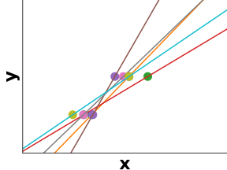

class: titlepage

.header[MOOC Machine learning with scikit-learn]

# Linear Model

This lesson covers the linear models. These are basic models, easy to understand and fast to train

???

Linear models are easy to understand and fast to train, 
they give us a fair baseline

---
# Outline

* Linear regression
 - L1 and L2 penalty
* Logistic regression
 - multi class
* linear separability

---
# Linear regression

Predict the value of the target **y**  
given some observation (explanatory variable) **X**

.shift-down.pull-left.shift-left[]

???
For illustration purpose, let's consider oen dimensionnal observation
Here the target value is expected to be a linear combination of the features
 
---
# Linear regression
A linear model is a slope "as close as possible" from datapoint
The blue curve is the prediction for each *x*

.shift-down.pull-left.shift-left[]

???

We learn f(x) = w_o + w_1 * x (linear combination) to predict *y*
So we learn w_0 and w_1 such that 
*| y_i - w_o + w_1 * x_i|^2* is minimal for all *i*

---
# Error in linear regression

For each sample, error is the distance between the curve and the point

.shift-down.pull-left.shift-left[]

???
That correspond to the red bar in the figure below

the fit is the line which minimize the sum of the square of those red lines.

---
# Solving the linear regression

Fortunatly, there is a efficient formula, given **X** and **y**, to find the optimal weights

???

---

# Linear regerssion in higher dimension

If **X** has two dimensions, we obtain a plot like that:

---
# Penalty
Linear model could also overfit. 
If we have too many parameters w.r.t. number of samples, it's highly advice to penalize the parameters of our models.

Simple way to penalize a model is to include teh value of its weights within the error function

???

---
# Linear regression with regularization

We could impose a penalty on the size of the coefficients (by modifying the error function)

L1 (Lasso) make sparse assumption 

L2 (Ridge) 

???
The complexity parameter  controls the amount of shrinkage: the larger the value of , the greater the amount of shrinkage and thus the coefficients become more robust to collinearity.

---
# Linear regression

.pull-left.shift-left[]

---
# Linear regression with regularization

.pull-left.shift-left[]
.pull-right[]

.pull-left.shift-left[Linear regression]
.pull-right[    Ridge]

???
http://scipy-lectures.org/packages/scikit-learn/index.html#bias-variance-trade-off-illustration-on-a-simple-regression-problem

Left: As we can see, our linear model captures and amplifies the noise in the data. It displays a lot of variance.

Right: Ridge estimator regularizes the coefficients by shrinking them to zero

Ridge displays much less variance. However it systematically under-estimates the coefficient. It displays a biased behavior.

This is a typical example of bias/variance tradeof: non-regularized estimator are not biased, but they can display a lot of variance. Highly-regularized models have little variance, but high bias. This bias is not necessarily a bad thing: what matters is choosing the tradeoff between bias and variance that leads to the best prediction performance. For a specific dataset there is a sweet spot corresponding to the highest complexity that the data can support, depending on the amount of noise and of observations available.

---
# Logistic Regression

Logistic regression learn a linear model for **classification** 
(and not regresion as the name suggest).  
So **y** is either +1 or -1

.shift-left.pull-left[]

???
Logistic regression learn a linear model for **classification** - and not regresion as the name suggest.

Exemple: succes to an exam after x hours of study.

---
# Logistic Regression

sigmoïd(x) = 1 / (1 + exp(-x))
  

.shift-left.pull-left[]

---
# Logistic Regression 2D

**X** is 2-dimensional  
**y** is the color

.shift-left.pull-left[]

???
other way of representation 
axis = x1, x2
y is the color

---
# Multiclass Logistic Regression

Logistic regression could adapt even if **y** is contains multiple class. It is called *multinomial regression*

.shift-left.pull-left[]

???
Mutlinomial could be used here
Otherwise, we stil can run One vs Rest approach

---
# Linear separability

.shift-left.pull-left[]
.pull-right[]

.pull-left.shift-left[Linearly separable]
.pull-right[    *Not* linearly separable]

???
Linear models work as long as your data could be linearly separable.

---
.center[
# Take home messages
]

* Linear model are good baselines for:
 - regression: linear regression + L2 penalty = Ridge
 - classification: logistic regression

* very fast to train
* Better when *p* > *n*

???
