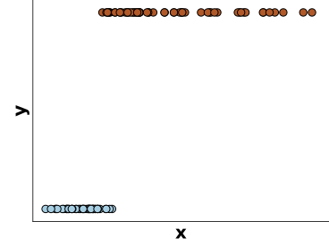
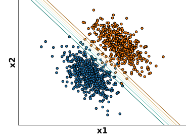
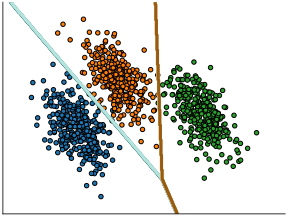
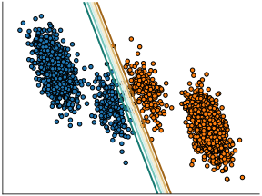

class: titlepage

.header[MOOC Machine learning with scikit-learn]

# Linear Model

For classification and regression.

Simple models, easy to understand and fast to train.


???

Linear models are easy to understand and fast to train.
They are typically good baselines.

We will cover intuitions on how they work in a machine learning 
settings.


---
# Outline

* What is a linear model?
* Linear model for regression & classification
* How to avoid overfitting?


---
class: split-60
# An example: estimating housing prices

.column1.data-table[
| Gr_Liv_Area | Year_Built | Full_Bath | Sale_Price |
| ----------- | ---------- | --------- | ---------- |
|        1656 |       1960 |         1 |      215.0 |
|         896 |       1961 |         1 |      105.0 |
|        1329 |       1958 |         1 |      172.0 |
|        2110 |       1968 |         2 |      244.0 |
|        1629 |       1997 |         2 |      189.9 |
]

.column2[
### Linear approximation of Sale_Price:

```
Sale_Price =       0.1 * Gr_Liv_Area
              +    1.1 * Year_Built
              -    8.9 * Full_Bath
              - 2200.0
```
]

???

The goal is to estimate a safe prices from numerical features characterizing
recently sold houses in a given city. The target is continuous, so we are
dealing with a regression problem instead of a classification problem.

The linear model assumes that the sale price (here expressed in thousands of
dollars) can be approximated by a linear combination of the features
(explanatory variables) + a final offset (also known as the intercept).

The learning procedure consists in estimating best possible values of the
coefficients of the linear combinations to minimize the average prediction
error.

---
class: split-40
# Linear regression

Predict the value of the target `y` given some observation `x`

.column1[

]

???

For illustration purpose, let's consider a 1-dimensional observations:
explaining the price as a function of a single feature, for instance the ground
living area.

---
class: split-40
# Linear regression

A linear model is a ramp "as close as possible" to all samples.
The blue curve shows the predictions for any possible `x`

.column1[

]

.column2[
```python
from sklearn.linear_model import LinearRegression


linear_regression = LinearRegression()
linear_regression.fit(X, y)
```
]

???

We learn a linear function to predict *y*. Here, the price is expressed
as a constant multiplied by the number of years of study.

Learning this function consists in finding the straight line which is
as close as possible as all the data points. 

The corresponding model can then be used to make predictions for any
possible `x`, as displayed by the blue line.

---
class: split-40
# Linear regression

The slope is chosen to minimize the distance between the prediction and the
data points

.column1[

]

.column2[
```python
from sklearn.linear_model import LinearRegression


linear_regression = LinearRegression()
linear_regression.fit(X, y)

y_pred = linear_regression.predict(X_new)
```
]

???

The slope of the line is chosen to minimize the distance between the
prediction and the data points. This distance constitutes an error
for each sample shown as the red bar on the figure.

The best fit is the blue line which minimizes the sum of the square of
those red lines.

Fortunately, scikit-learn has an estimator, the `LinearRegression`
object, that computes this for us.

---
class: split-60
# Linear regression with several variables

.column1[

]

.column2[
The mental picture needs to be extended to several dimensions.

For instance, in 2D:

```
Sale_Price =       0.1 * Gr_Liv_Area
              +    1.1 * Year_Built
              - 2209.0
```
]

???

With more variables, the mental picture needs to be extended to several
dimensions. However, the idea is the same: a linear model tries to
minimize the error between the predictions and the data points.
The predictions now form a plane.

Often, the data have many features, and thus many dimensions. It is common to
build models with hundreds of variables. It is no longer possible to visualize
the fitting with a simple figure.

For some applications in biology such as Genetics for instance practitioners
use hundreds of thousands of input variables. 

---
class: split-30
# For classification: logistic regression

For **classification**, we use a logistic regression model: `y` is either 0
(blue) or 1 (red)

.column1[

]

.column2[
 ```python
from sklearn.linear_model import LogisticRegression


log_reg = LogisticRegression()

 ```
]

???
The prediction target, `y`, is binary. It can be represented by either
0 or 1. However, a straight line is not suited to try to explain
such binary target.

Hence, dedicated linear models for classification are needed. *Logistic
regression* is such a model: it is intended for **classification** and
not regression as the name would wrongly suggest.


---
class: split-30
# For classification: logistic regression

The output of the model is interpreted as the probability of
y being 1 (red) for a given x.

.column1[

]

.column2[
 ```python
from sklearn.linear_model import LogisticRegression


log_reg = LogisticRegression()
log_reg.fit(X, y)
 ```
]

???

With logistic regression, the output is modelled using a form of soft
step function, adjusted to the data. This function is called a logistic
function. Using a soft, graduate shift between *y = 0* and *y = 1* is
useful to capture the grey zone, where the value of *x* is not enough
to decide whether the target value is 0 (blue) or 1 (red) with high
confidence.

In scikit-learn, this is done with the `LogisticRegression` object.

---
class: split-50
# Logistic regression in 2 dimensions

`X` is 2-dimensional, `y` is represented by the color

.column1[

]
.column2[

]

???

If the data has two features, it is convenient to represent it
differently.

Here, `X` has two dimensions `x1` and `x2`.

The data points are represented as dots, the input features now appear as two
dimensions that give the location of the data point in a 2D plane.
The target is to predict the color of the data points that represent the class
membership.

2D surface that represent the probability to belong to the red class `y = 1` at
a given location `x`. The decision function learned by logistic regression is
represented by the soft any given position in the `(x1, x2)` space.

This `(x1, x2)` space is called the feature space. Logistic regression is a
models that internally computes a weighted sum of the values of the input
features (similarly to linear regression). As a result, the shape of the
decision boundary between regions assigned different classes is a straight
line.

The models assigns probability close to 0.5 for features close to the decision
boundary. For points far away from the decision boundary, the model confidently
predict values very close to 0 or 1 on each side.

For common machine learning use cases, we typically have many more than
two input features. Unfortunately it's not really possible to graphically
represent the decision boundary of a logistic regression model in high
dimensional space.

---
class: split-50
# Logistic regression & multiclass classification

.column1[
  
]
.column2[
- `y` in {0, 1, 2}
- `y` in {blue, orange, green}

For a given input ``x``:
  - predict one probability per class
  - probabilities sum to 1
]
???

So far, we have considered the case where the output `y` is binary.
When there is more than 2 classes to choose from.

The `LogisticRegression` estimator can natural be extended to support
multiclass classification.

Instead of predicting one number which can be interpreted as the probability of
`x` being assigned class 1, the model nows predicts 3 numbers: the
probabilities of `x` being either assigned class 0 (blue), 1 (orange) or 2
(green). Those three numbers must sum to 1.

The "true" value of `y` is one of those 3 possibilities. The class labels are
exclusive.

Agains the trained models finds a way to define regions of the feature space,
one for each class. The shape of the decision boundary are (segments) of
straight lines because Logistic Regression internally builds a linear
combination of the input features: it is a linear model.

---
class: split-50
# Linear models are not suited to all data

.column1[


Linearly separable
]

.column2[


**Not** linearly separable →&nbsp;Underfitting
]


???

Linear models work well if the classes are linearly separable.

However, sometimes, the best decision boundary to separate classes is not well
approximated by a straight line.

In such a situation, we can either use non-linear models, or perform
transformations on the data, to engineer new features. We will cover these in
other lessons.

---
.center[
# Take home messages on linear models
]

* Simple and fast baselines for:
 - **regression**: linear regression
 - **classification**: logistic regression

--
* Can underfit when: `n_features << n_samples`
  →&nbsp;engineering new features can help!

--
* Hard to beat when `n_features` is large

--
* Regularization helpful in this case

???

To summarize on linear models:

They form good baselines that can be easily understood. A later lesson
will cover in details the intuitive interpretations of linear-model
coefficients.

Linear models are fast to train and fast to predict, and hence convenient to
interactively design predict models but also more efficient to deploy in
production at scale and on energy limited hardware (mobile phones).

For regression, a good choice is typically to use a Ridge regression,
which adds a simple regularization.

For classification, a good choice is to use a logistic regression. The
scikit-learn implementation is regularized by default.

When linear models underfit (on non-linearly separable data), it is often
possible to engineer new features to mitigate the problem. We will see
examples of this strategy in the next exercises and notebooks.

Linear models are particularly useful when the number of features is larger
than the number of samples: more complex model can typically struggle more than
regularized linear models in this regime for no added improvement in predictive
performance.


---
class: titlepage

.header[MOOC Machine learning with scikit-learn]

# Regularized Linear Models

How to avoid overfitting?


---
# Do linear models overfit?

- Linear models are simpler than alternatives
--

- → they tend to overfit less than alternatives
--

- They even often underfit when:
  - `n_features` is small (e.g. less than 10 features)
  - the problem is not linearly separable

--

But...

---
# Linear models can also overfit!

Possible causes:

- `n_samples << n_features`
- Many uninformative features


--
Example for linear regression:

.larger[
```
Sale_Price =      0.1 * Gr_Liv_Area
             +    1.1 * Year_Built
             -    8.9 * Full_Bath
             +    2.5 * Zodiac_sign_first_owner_is_capricorn
             -    1.5 * Zodiac_sign_first_owner_is_taurus
             ...
             - 2200.0
```
]

???

Fitting linear models with thousands of unrelated features can make linear
models easily overfit any data.

One solution would be to filter-out useless features:

- it's somewhat possible using automated [feature selection methods](
    https://scikit-learn.org/stable/modules/feature_selection.html)

- but this is not always easy to tell if a given decision should be included or
  not

---
class: split-50
# Regularization can reduce overfitting

.column1[
Unregularized regression:

```python
from sklearn.linear_model \
    import LinearRegression

model = LinearRegression().fit(X, y)
 ```
]

--

.column2[
Ridge regression:

```python
from sklearn.linear_model import Ridge

model = Ridge(alpha=0.01).fit(X, y)
```
]

--
.nocolumn[
**Ridge regression** pulls the coefficients towards 0.
]

--
.nocolumn[
Large `alpha` → more regularization
]


--
.nocolumn[
**Recommendation**: always use `Ridge` with a good `alpha`!
]

???

If we have too many parameters in regard to the number of samples, the
linear model can overfit: it assigns non-zero weights to associations by
chance.

As described in a previous lecture, the problem with overfit is that the model
learns a decision function that is too complicated: here the non-zero
associations to unrelated factors such as the Zodiac sign of the first owner.
As a consequence, the model generalizes poorly.

The solution is to regularize the model: to foster less complex
solutions. For this purpose, a linear model can be regularized by
slightly biasing to choose smaller weights for almost a similar fit.

The `Ridge` estimator does this in scikit-learn.

This model comes with a complexity parameter that controls the amount of
regularization. This parameter is named `alpha`. The larger the value of
`alpha`, the greater the bias, and thus the smaller the coefficients.

---
# Bias-variance tradeoff in Ridge regression


.pull-left.shift-left[]
.pull-right[]

.pull-left.shift-left[&nbsp; &nbsp; &nbsp; Low bias, high variance]
.pull-right[&nbsp; &nbsp; &nbsp; High bias, low variance]
???
Let's illustrate the ridge's bias-variance tradeoff.

With 2 data points, a non-biased linear model fits perfectly the data.

When there is noise in the data, the non-biased linear model captures this
noise if there is few training samples. As a result, it displays a lot of
*variance* in its predictions: retraining on another training set with the same
number of data point would yield a very different prediction function.

On the right, we have a ridge estimator with a large value of `alpha`,
regularizing the coefficients by shrinking them to zero.

The ridge displays much less variance. However, it systematically
under-estimates the coefficient. It displays a **biased** behavior.

---
# Bias-variance tradeoff in Ridge regression

.split-3columns[
.column[


.center[Too much variance]
]
.column[


.center[Best tradeoff]
]
.column[


.center[Too much bias]
]
]
.split-50[
.column1[.center[*Small alpha*]]
.column2[.center[*Large alpha*]]
]

???

This is a typical example of bias/variance tradeoff: non-regularized
estimator are not biased, but they can display a lot of variance.
Highly-regularized models have little variance, but high bias.

This bias is not necessarily a bad thing: what matters is choosing the
tradeoff between bias and variance that leads to the best prediction
performance. For a specific dataset there is a sweet spot corresponding
to the highest complexity that the data can support, depending on the
amount of noise and observations available.

Given new data points, beyond our two initial measures, the sweep spot
minimizes the error. For the specific case of the `Ridge` estimator, in
scikit-learn, the best value of `alpha` can be automatically found
using the `RidgeCV` object.

Note that, in general, for prediction, it is always better to prefer
`Ridge` over a `LinearRegression` object. Using at least a small amount
of regularization is always useful.


---
class: split-50
# Automated tuning for regularization

.column1[
 ```python
from sklearn.linear_model \
    import Ridge
from sklearn.model_selection \
    import GridSearchCV


param_grid = {
    "alphas": [0.001, 0.1, 1, 10, 1000],
}
model = GridSearchCV(Ridge(), param_grid)
model.fit(X, y)

print(model.best_parameters_)
```
]

--
.column2[
 ```python
from sklearn.linear_model import RidgeCV


model = RidgeCV(
    alphas=[0.001, 0.1, 1, 10, 1000]
)
model.fit(X, y)

print(model.alpha_)
```

Almost as fast as fitting a single `Ridge` model!
]

---
# Regularization in logistic regression

.small[The parameter `C` controls the complexity of the model, high C value → more flexibility.]

.shift-up-less.shift-left.pull-left[]
.shift-up-less.pull-right[]
.shift-up.pull-left.shift-left[&nbsp;&nbsp;Small `C`]
.shift-up.pull-right[&nbsp;&nbsp;Large `C`]

.width65.shift-up-less.centered[
 ```python
from sklearn.linear_model import LogisticRegressionCV
 ```
]

???

For classification, logistic regression also comes with regularization.


In scikit-learn, this regularization is controlled by a parameter called
`C`, which has a slightly different behavior than `alpha` in the Ridge
estimator.

For a large value of `C`, the model puts more emphasis on the data points
close to the frontier.
On the contrary, for a low value of `C`, the model considers all the points.

As with Ridge, the tradeoff controlled by the choice of `C` depends on
the dataset and should be tuned for each set. This tuning can be done in
scikit-learn using the `LogisticRegressionCV` object.

---
.center[
# Take home messages on linear models
]

* Can overfit when:

 - `n_samples` is too small and `n_features` is large
 -  In particular with non-informative features

--
* Regularization for **regression**:
 - linear regression → ridge regression
 - large `alpha` parameter → strong regularization

--
* Regularization **classification**:
 - logistic regression regularized by default
 - small `C` parameter → strong regularizations

???

Always use regularization when fitting linear models: you can tune the
regularization parameter using cross-validation.

In particular for Ridge regression `RidgeCV` is efficient fast at tuning
`alpha` automatically.
