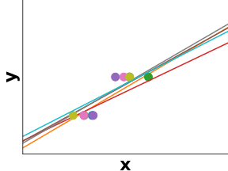

class: titlepage

.header[MOOC Machine learning with scikit-learn]

# Linear Model

This lesson covers the linear models. These are basic models, easy to understand and fast to train

???

Linear models are easy to understand and fast to train
They give us a baseline

---
# Outline

* Linear regression
* Logistic regression
 - (classification vs regression) ?
* multi class
* linear separability
* L1 and L2 penalty
* (Learning curves and validation curves) ?
---
# Linear regression

Here we have to predict the value of the target **y** given some observation (explanatory variable) **X**. For illustration purpose, we will consider that the observation is only one dimensional.

.shift-left.pull-left[]

???

Here the target value is expected to be a linear combination of the features
 
---
# Linear regression (Ordinary Least Squares)

We look for the best fit, i.e. we learn w_0 and w_1 such that 
*| y_i - w_o + w_1 * x_i|^2* is minimal for all *i*

.shift-left.pull-left[]

???

---
# Error in linear regression

For each sample x_i, we than have an error which correspond to |y_i - ŷ_i|^2
(where ŷ_i = w_o + w_1 * x_i)
That correspond to the red bar in the figure below
.shift-left.pull-left[]

???
the fit is the line which minimize the sum of the square of the red lines.

---
# Linear regerssion in higher dimension

If **X** has two dimensions, we obtain a plot like that:

---
# Linear regression with regularization

We could impose a penalty on the size of the coefficients (by modifying our error function)

L1 (Lasso) make sparse assumption 

L2 (Ridge) 

error is now: C*|y_i - ŷ_i|^2 + |w_0|^2 + |w_1|^2
where C control the ration between the error and the penalty.

???
The complexity parameter  controls the amount of shrinkage: the larger the value of , the greater the amount of shrinkage and thus the coefficients become more robust to collinearity.

---
# Linear regression with regularization

Left: severals fit on 2 points  

Right: severals fit on 2 points with L2 penalty

.shift-left.pull-left[]
.shift-right.pull-right[]

???
http://scipy-lectures.org/packages/scikit-learn/index.html#bias-variance-trade-off-illustration-on-a-simple-regression-problem

Left: As we can see, our linear model captures and amplifies the noise in the data. It displays a lot of variance.

Right: Ridge estimator regularizes the coefficients by shrinking them to zero

As we can see, the estimator displays much less variance. However it systematically under-estimates the coefficient. It displays a biased behavior.

This is a typical example of bias/variance tradeof: non-regularized estimator are not biased, but they can display a lot of variance. Highly-regularized models have little variance, but high bias. This bias is not necessarily a bad thing: what matters is choosing the tradeoff between bias and variance that leads to the best prediction performance. For a specific dataset there is a sweet spot corresponding to the highest complexity that the data can support, depending on the amount of noise and of observations available.

---
# Logistic Regression

With Logistic regression, we learn a linear model for *classification* (and not regresion as the name suggest).
So **y** is either +1 or -1

.shift-left.pull-left[]

???
Exemple: succes to an exam after x hours of study.

---
# Logistic Regression

sigmoïd(x) = 1 / (1 + exp(-x))
Proba(Y_i=1) = 1 / (1 + exp(-X_i . W))
.shift-left.pull-left[]

---
# Multiclass Logistic Regression

sigmoïd(x) = 1 / (1 + exp(-x))
Proba(Y_i=1) = 1 / (1 + exp(-X_i . W))
.shift-left.pull-left[]

---
.center[
# Take home messages
]
* Linear model are good baselines for:
 - regression: linear regression + L2 penalty = Ridge
 - classification: logistic regression

* Better when *p* > *n*

???

.shift-left.pull-left[]

.pull-right[]

.shift-left.pull-left[]
.pull-right[]
.centered.reversed[**On new data**]

.shift-left.pull-left[]
.pull-right[]
.centered[A harder example]
