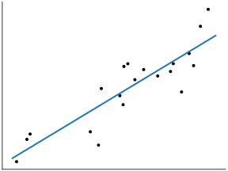
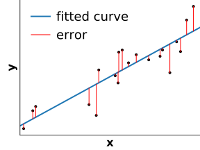
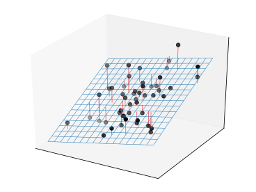
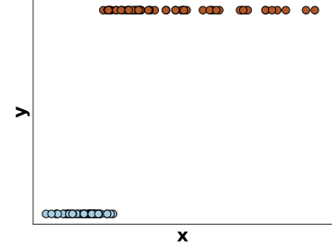
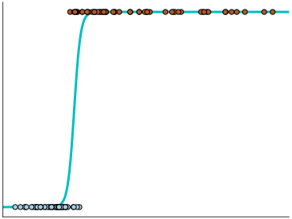
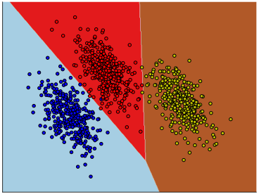
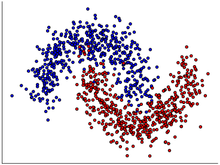

class: titlepage

.header[MOOC Machine learning with scikit-learn]

# Linear Models

For classification and regression.

Simple models, easy to understand and fast to train.


???

Linear models are easy to understand and fast to train.
They are typically good baselines.

We will cover intuitions on how they work in a machine learning 
settings.


---
# Outline

* What is a linear model?
* For regression: linear regression
* For classification: logistic regression
* Non linearly separable data


---
class: split-60
# An example: estimating housing prices

.column1.data-table[
| Gr_Liv_Area | Year_Built | Full_Bath | Sale_Price |
| ----------- | ---------- | --------- | ---------- |
|        1656 |       1960 |         1 |      215.0 |
|         896 |       1961 |         1 |      105.0 |
|        1329 |       1958 |         1 |      172.0 |
|        2110 |       1968 |         2 |      244.0 |
|        1629 |       1997 |         2 |      189.9 |
]

--

.column2[
### Linear approximation of Sale_Price:

```
Sale_Price =       0.1 * Gr_Liv_Area
              +    1.1 * Year_Built
              -    8.9 * Full_Bath
              - 2200.0
```
]

???

The goal is to estimate sale prices from numerical features characterizing
recently sold houses in a given city. The target is continuous, so we are
dealing with a regression problem instead of a classification problem.

The linear model assumes that the sale price (here expressed in thousands of
dollars) can be approximated by a linear combination of the features
(explanatory variables) + a final offset (also known as the intercept).

The learning procedure consists in estimating best possible values of the
coefficients of the linear combinations to minimize the average prediction
error.

---
class: split-40
# Linear regression

Predict the value of the target `y` given some observation `x`

.column1[

]

.column2[
### Linear approximation of Sale_Price:

```
Sale_Price =       0.1 * Gr_Liv_Area
              - 2200.0
```
]

???

For illustration purpose, let's consider a 1-dimensional observations:
explaining the price as a function of a single feature, for instance the gross
living area.

---
class: split-40
# Linear regression

Fit a prediction line as close as possible to all training points.

.column1[

]

.column2[
```python
from sklearn.linear_model import LinearRegression


linear_regression = LinearRegression()
linear_regression.fit(X, y)
```
]

???

We learn a linear function to predict `y`. Here, the price is expressed
as a constant multiplied by the area plus an intercept.

Learning this function consists in finding the straight line which is
as close as possible as all the data points. 

The corresponding model can then be used to make predictions for any
possible `x`, as displayed by the blue line.

---
class: split-40
# Linear regression

The slope is chosen to minimize the distance between the prediction and the
data points

.column1[

]

.column2[
```python
from sklearn.linear_model import LinearRegression


linear_regression = LinearRegression()
linear_regression.fit(X, y)
```
]
--
.column2[
```python
import numpy as np

y_pred = linear_regression.predict(X)
squared_error = np.sum((y - y_pred) ** 2)
```
]

???

The best fit is represented by the blue line which minimizes the sum of the
square differences between the predicted values and the values of the target
variable represented by the red segments.

This minimization happens when we call the `fit` method of the
`LinearRegression` class. The result is the automated tuning of the slope and
intercept coefficient of the linear model.

---
class: split-60
# Linear regression with several variables

.column1[

]

.column2[
The mental picture needs to be extended to several dimensions.

For instance, in 2D:

```
Sale_Price =       0.1 * Gr_Liv_Area
              +    1.1 * Year_Built
              - 2209.0
```
]

???

With more variables, the mental picture needs to be extended to several
dimensions. However, the idea is the same: a linear model tries to
minimize the error between the predictions and the data points.
The predictions now form a plane.

Often, the data have many features, and thus many dimensions. It is common to
build models with hundreds of variables. It is no longer possible to visualize
the fitting with a simple figure.

For some applications in biology such as Genetics for instance practitioners
use hundreds of thousands of input variables. 

---
class: split-30
# For classification: logistic regression

For **classification**, we use a logistic regression model: `y` is either 0
(blue) or 1 (red)

.column1[

]

.column2[
 ```python
from sklearn.linear_model import LogisticRegression


log_reg = LogisticRegression()

 ```
]

???
The prediction target, `y`, is binary. It can be represented by either
0 or 1. However, a straight line is not suited to try to explain
such binary target.

Hence, dedicated linear models for classification are needed. *Logistic
regression* is such a model: it is intended for **classification** and
not regression as the name would wrongly suggest.


---
class: split-30
# For classification: logistic regression

The output of the model is interpreted as the probability of
y being 1 (red) for a given x.

.column1[

]

.column2[
 ```python
from sklearn.linear_model import LogisticRegression


log_reg = LogisticRegression()
log_reg.fit(X, y)
 ```
]

???

With logistic regression, the output is modeled using a form of soft
step function, adjusted to the data. This function is called a logistic
function. Using a soft, graduate shift between *y = 0* and *y = 1* is
useful to capture the grey zone, where the value of *x* is not enough
to decide whether the target value is 0 (blue) or 1 (red) with high
confidence.

In scikit-learn, this is done with the `LogisticRegression` object.

---
class: split-50
# Logistic regression in 2 dimensions

`X` is 2-dimensional, `y` is represented by the color

.column1[

]
.column2[

]

???

If the data has two features, it is convenient to represent it
differently.

Here, `X` has two dimensions `x1` and `x2`.

The data points are represented as dots, the input features now appear as two
dimensions that give the location of the data point in a 2D plane.
The target is to predict the color of the data points that represent the class
membership.

2D surface that represent the probability to belong to the red class `y = 1` at
a given location `x`. The decision function learned by logistic regression is
represented by the soft any given position in the `(x1, x2)` space.

This `(x1, x2)` space is called the feature space. Logistic regression is a
models that internally computes a weighted sum of the values of the input
features (similarly to linear regression). As a result, the shape of the
decision boundary between regions assigned different classes is a straight
line.

The models assigns probability close to 0.5 for features close to the decision
boundary. For points far away from the decision boundary, the model confidently
predict values very close to 0 or 1 on each side.

For common machine learning use cases, we typically have many more than
two input features. Unfortunately it's not really possible to graphically
represent the decision boundary of a logistic regression model in high
dimensional space.

---
class: split-50
# Logistic regression & multiclass classification

.column1[
  
]
.column2[
- `y` in {0, 1, 2}
- `y` in {blue, orange, green}

For a given input ``x``:
  - predict one probability per class
  - probabilities sum to 1
]
???

So far, we have considered the case where the output `y` is binary.
When there is more than 2 classes to choose from.

The `LogisticRegression` estimator can natural be extended to support
multiclass classification.

Instead of predicting one number which can be interpreted as the probability of
`x` being assigned class 1, the model nows predicts 3 numbers: the
probabilities of `x` being either assigned class 0 (blue), 1 (orange) or 2
(green). Those three numbers must sum to 1.

The "true" value of `y` is one of those 3 possibilities. The class labels are
exclusive.

Agains the trained models finds a way to define regions of the feature space,
one for each class. The shape of the decision boundary are (segments) of
straight lines because Logistic Regression internally builds a linear
combination of the input features: it is a linear model.

---
class: split-50
# Linear models are not suited to all data

.column1[


*Almost* linearly separable
]

--

.column2[


**Not** linearly separable →&nbsp;Underfitting
]


???

Linear models work well if the classes are (almost) linearly separable.

However, sometimes, the best decision boundary to separate classes is not well
approximated by a straight line.

In such a situation, we can either use non-linear models, or perform
transformations on the data, to engineer new features. We will cover these in
a the following notebooks.

---
.center[
# Take home messages on linear models
]

* Simple and fast baselines for:
 - **regression**: linear regression
 - **classification**: logistic regression

--
* Can underfit when: `n_features << n_samples`
  →&nbsp;engineering new features can help!

--
* Hard to beat when `n_features` is large

???

To summarize on linear models:

They form good baselines that can be easily understood. A later lesson
will cover in details the intuitive interpretations of linear-model
coefficients.

Linear models are fast to train and fast to predict, and hence convenient to
interactively design predict models but also more efficient to deploy in
production at scale and on energy limited hardware (mobile phones).

For regression, a good choice is typically to use a Ridge regression,
which adds a simple regularization.

For classification, a good choice is to use a logistic regression. The
scikit-learn implementation is regularized by default.

When linear models underfit (on non-linearly separable data), it is often
possible to engineer new features to mitigate the problem. We will see
examples of this strategy in the next exercises and notebooks.

Linear models are particularly useful when the number of features is larger
than the number of samples: more complex model can typically struggle more than
linear models in this regime for no added improvement in predictive
performance.

However in high dimensions, we need to use regularized linear models which
will introduce in the next presentation.
