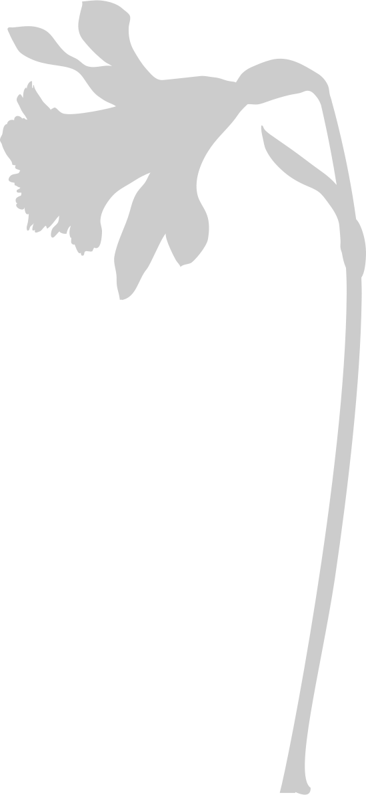
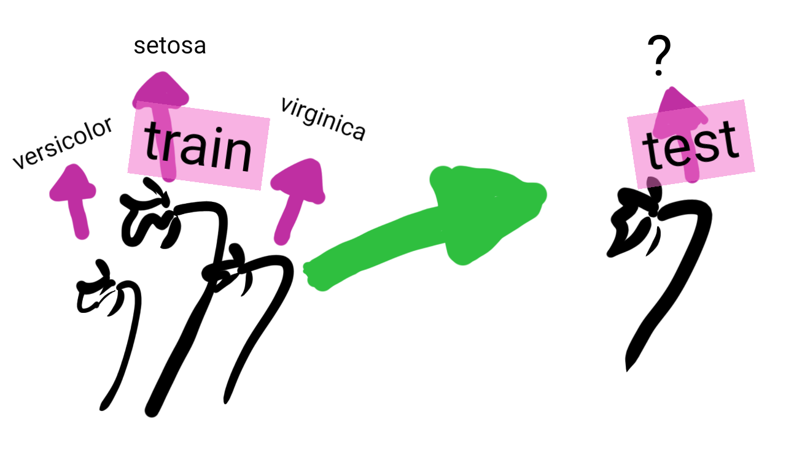

class: center, middle

# MOOC Machine learning with scikit-learn

???

Hi, welcome to the MOOC on machine learning with scikit-learn

---

class: titlepage

# What is machine learning?

A first, introductory lesson, focusing on general concepts rather than
coding or maths.

???

In this video, we will discover what is machine learning and its
general underlying concepts. This lesson is an introduction and focuses
on general concepts, rather than coding or maths.

---
# What is machine learning?

Machine learning deals with building predictive models

???

So, what is machine learning?

In a nutshell, machine learning is about building predictive models. I
will explain what we mean by predictive models later on.

---
class: center, middle

# Why and when?

Some examples of machine learning

???

First of all, I would like to discuss : Why and when would we use machine learning?

Let me start with a couple examples.

---

# Which iris is that?

???

*Pick up a iris*,

Consider flowers, for instance. I am not very good at recognizing them.
This is an iris. But what type?

--

.tight[
* Setosa
* Versicolor
* Virginica
]

???

There are three classic types of iris,

> Setosa - Versicolor - Virginica

Maybe I can use machine learning to build mathematical rules to set them
apart?

For this, I will describe the irises with numbers. I can measure the
dimensions of there sepal and petal. *Pick up a ruler, and pretend to
measure*

--

| Sepal length | Sepal width | Petal length | Petal width | Iris type  |
| ------------ | ----------- | ------------ | ----------- | ---------- |
| 6cm          | 3.4cm       | 4.5cm        | 1.6cm       | versicolor |
| 5.7cm        | 3.8cm       | 1.7cm        | 0.3cm       | setosa     |
| 6.5cm        | 3.2cm       | 5.1cm        | 2cm         | virginica  |
| 5cm          | 3.cm        | 1.6cm        | 0.2cm       | setosa     |

???

Now I have a set of numbers describing irises. Can I build decision rules
from them? Maybe. See, for instance, it seems that setosa irises have a
very small petal.

---

# Is this person rich?

???

Let us consider a problem closer to a business case; that of estimating
the income of someone.

--

US Census data:

.very-small[

| Age | Workclass | Education    | Marital-status     | Occupation         | Relationship | Race  | Sex  | Capital-gain | Hours-per-week | Native-country | Class |
| --- | --------- | ------------ | ------------------ | ------------------ | ------------ | ----- | ---- | ------------ | -------------- | -------------- | ----- |
| 25  | Private   | 11th         | Never-married      | Machine-op-inspct  | Own-child    | Black | Male | 0            | 40             | United-States  | <=50K |
| 38  | Private   | HS-grad      | Married-civ-spouse | Farming-fishing    | Husband     | White  | Male | 0            | 50             | United-States   | <=50K |
| 28  | Local-gov | Assoc-acdm   | Married-civ-spouse | Protective-serv    | Husband      | White | Male | 0            | 40             | United-States   | >50K  |
| 44  | Private   | Some-college | Married-civ-spouse | Machine-op-inspct  | Husband      | Black | Male | 7688         | 40             | United-States   | >50K  |

]

???

For this, we can use data from the US census.

As you see, it gives is fairly diverse information about individuals : *age, workclass, education, marital-statut, occupation, relationship...*, as well as whether they earn more or less than 50 thousand dollars a year.
We can use machine learning to build rules that will predict this income
information from the rest of the demographic information.

You can also see that, even in a simple example like this, having
intuition about the information available on many individuals can be a
bit challenging. Data visualization will come in handy.

---
# Engineering rules: data versus experts

Expert knowledge: setosa irises have small petals

???

So, machine learning is about engineering decision rules from the data.
But experts can also engineer decision rules from their knowledge of the
problem. For instance, experts know that setosa irises have small petals.

--

<table>
<thead><tr>
	<th>Sepal length</th>
	<th>Sepal width</th>
	<th>Petal length</th>
	<th>Petal width</th>
</tr></thead>
<tbody><tr>
    <td>
    
    </td>
    <td>
    
    </td>
    <td>
    
    </td>
    <td>
    
    </td>
    </tr></tbody>
</table>

This rule can be inferred from the data

???

This rule can also be inferred by looking at the data. If we look at the
distribution of the sepal and petal measurements for the different iris
species, we can see that petal length and width single well out setosa.

*But how can we deal with more complex, more numerous data? *

**The benefit of machine-learning is that it automates the creation of rules from the data, including their details, such as where exactly
to set the threshold.**

*In concrete terms, machine learning allow predictions from data, based for instance on predictive analyses.* 

---
class: center, middle

# Predictive analysis

Beyond classic statistical tools

???
We will now get to the heart of the matter by focusing on predictive models.

To build predictive models we are going to rely on statistical
properties of the data. However, there questions and the tools that we
will use differ a bit from those traditionally used in statistics.

---
# Generalizing

Concluding on new instances

???

In machine learning, we want to conclude on new instances. In the 
example on the census, I want to be able to predict the income of new
individuals, which a combination of jobs and demographics that I have
never seen.

--

Many sources of variability:

.tight.columns[
* age
* workclass
* education 
* marital-status
* occupation
* relationship
* race
* sex
* capital-gain
* hours-per-week 
* native-country
]

???

The challenge is that there are many ways an individual can
vary, even within the limited description given by our data.

--

*+* Noise: unexplainable variance

???

An additional difficulty is the noise in the data. By noise, we mean the
aspects that cannot by explained by solely from the data. For instance,
an individual's income may have been influenced by the mood of his manager 
during his annual review.

---
# Memorizing

* store all known individual .small[(the census)]
* given a new individual, predict the income of its closest match in our database

???

One possibility for prediction is to memorize the whole available data.

Given the problem of predicting income, we can store all known
individuals, the census. Then, give a new individual, we predict the
income of its closest match in our database.

This strategy is known is machine learning as a "nearest neighbor"
predictor.

--

Trying out this strategy on the data we have, the census, *what error
rate do we expect?*

???

If we try this strategy on the data we have, the census, what error rate
do we expect?

--

> **0 errors**

???

Every individual for which we are asking a prediction is in our database.
Thus, its closest match will be itself, and as a consequence, we will
have zero prediction error.

--

.red[Yet, we will make errors on **new** data]

???

However, if we try our strategy on unseen data, it will not be able to
find exact match. Hence, it is likely to make some errors.

---

.center.large.reversed[**Generalizing &nbsp;≠&nbsp; Memorizing** &nbsp;]

???

What we are seeing here is that generalizing is very different from
memorizing. This is a fundamental challenge of machine learning.

--

.center["test" data &nbsp;≠&nbsp; "train" data]

.pull-left[Data on which the predictive model is applied]

.pull-right[Data used to learn the predictive model]

&nbsp;   

&nbsp;   

* Different sampling of noise
* Unobserved combination of features

???

The reason is that the data on which we apply the predictive model, known
as the test data, is different from the data used to build the predictive
model, known as the train data.

They are different because there might be different noise, but also
because there might be individuals with new configuration of features
that we have not observed: different combinations of occupation, age, and
marital status.

---

# The machine-learning workflow

???

The typical workflow in machine-learning is to use a given dataset to
learn a predictive model, for instance predicting the type of iris, and
then to apply it to new data, or what we will call a "test" set, to put
the model in production, or to check it's validity.

---

class: center, middle

# Some vocabulary

???

To go further, it is useful to define a bit the concepts of machine
learning

---

# The data matrix

We deal with a table of data:

* Rows are different observations, or **samples**
* Columns are different descriptors, or **features**

.small[
| Sepal length | Sepal width | Petal length | Petal width | Iris type  |
| ------------ | ----------- | ------------ | ----------- | ---------- |
| 6cm          | 3.4cm       | 4.5cm        | 1.6cm       | versicolor |
| 5.7cm        | 3.8cm       | 1.7cm        | 0.3cm       | setosa     |
| 6.5cm        | 3.2cm       | 5.1cm        | 2cm         | virginica  |
| 5cm          | 3.cm        | 1.6cm        | 0.2cm       | setosa     |
]

???

All the data that we will consider will be in what we call a "data
matrix". It can be seen as describing our problem in a 2D table: 

* the different rows of this table are different observations, for
  instance different irises. We call these "samples"

* the columns of this table give the different measures or descriptors
  that we have for these samples. We call them "features".

---

# Supervised machine learning

* A data matrix *X* with *n* observations

* A **target** *y*: a property of each observation

The goal is to **predict** *y*

???

In supervised machine learning, 
the data we have are annotated, i.e. they are associated with a label or a target class.
As for our Iris, each data is associated with a type of Iris: our target class.
The purpose of supervised learning is to predict this target (i.e. the type of iris) on new unannotated data (by entering only petal and sepal dimensions).

With a mathematical representation : in supervised machine learning, we are given 

* a data matrix, that we shall denote *X*, with *n* observations

* and a **target** *y*, which gives a characteristic for each observation

The goal of supervised learning is to predict y from *X*.

---

# Unsupervised machine learning

* A data matrix *X* with *n* observations

The goal is to extract from *X* structure that generalizes.

Very wide variety of different problems.

???

In unsupervised learning, we are given the data matrix *X*, but we have
no available target. 

The goal is then to extract some form of structure from *X* that
generalize to new data.

If we take the example of the Iris, in unsupervised learning, the input data would not include the type of Iris because the data is not annotated. 
The goal will therefore be to find alone the similarities and distinctions within the data, and to group together data that share common characteristics. 

Unsupervised learning covers a very wide variety of different problems. We
will not cover them for now.

---

# Regression and classification

Supervised learning: predicting a target *y*

* **Classification**: *y* is discrete, made of different classes

  *eg* irises: Setosa, Versicolor, Virginica

* **Regression**: *y* is continuous, a numerical quantity

  *eg* wage prediction

???

Going back to supervised learning, we have to predict a target *y*. This
target is a property of our data.

It may be discrete, describing different classes of the data. For
instance with irises, we are trying to predict the type of iris. In such
a situation, we say that it is a classification task.

It may be continuous, describing a numerical property of our observation.
For instance, when trying to predict from the census who is rich, it
would be interesting to predict the income, in dollars. In such a
sitation, we way that it is a regression task.

---

.center[
# Take home messages
]

* Machine learning is about extracting from *data* rules that *generalize*
  to new observations

* We work with:

  - a data matrix *X* *n_samples* x *n_features*
  - a target *y* of length *n_samples*, made of numbers for *regression*
    and of discrete classes for *classification*

???

To summarize, machine learning is about extracting from data rules that
generalize to new observations.

In practice, we will work with a data matrix, that we will call *X*, with
a *n_samples* rows times *n_features* columns. For supervised learning,
we have a target vector *y*, of length *n_samples*, which is made of
numbers characterizing each observation for regression problems and of
discrete classes for classification problems.

