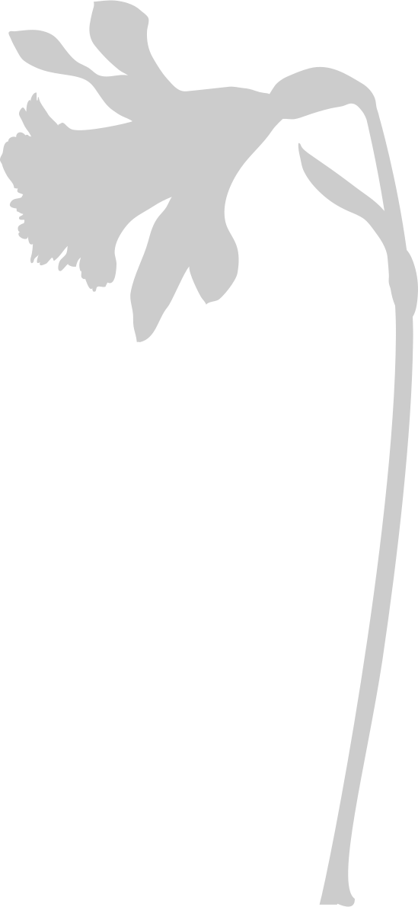
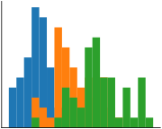
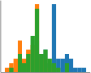
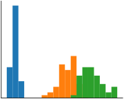
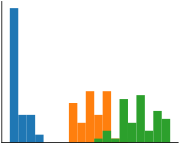
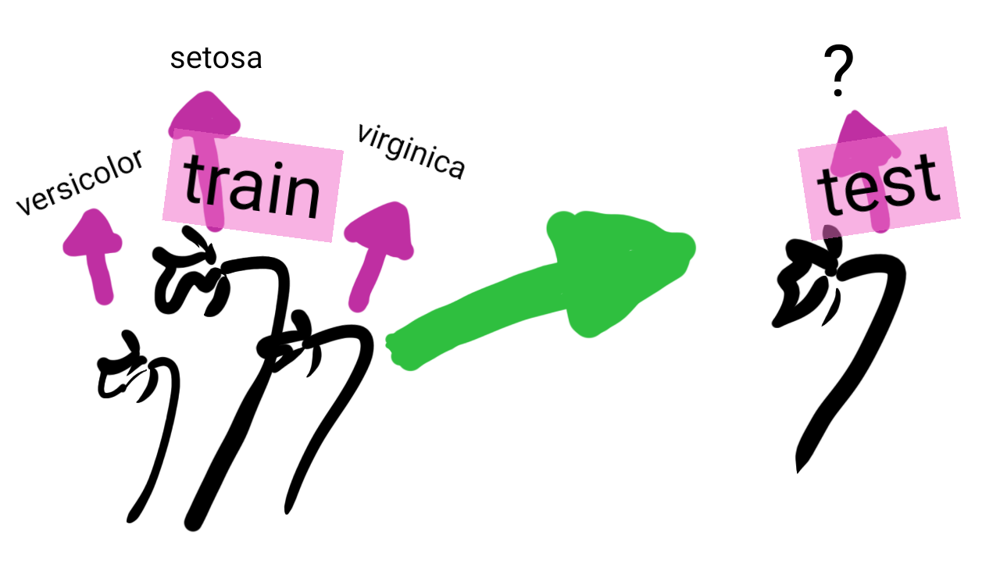
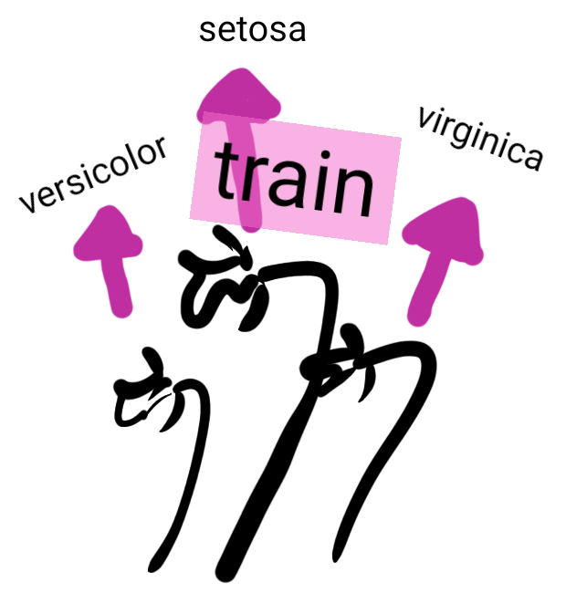
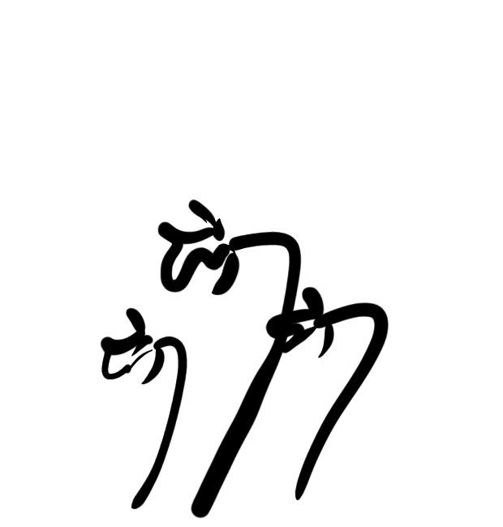

class: center, middle

# MOOC Machine learning with scikit-learn

???

Hi, welcome to the MOOC on machine learning with scikit-learn

---

class: titlepage

.header[MOOC Machine learning with scikit-learn]

# What is machine learning?

A first, introductory lesson, focusing on general concepts rather than
coding or maths

???

In this lesson, we will discover what machine learning is, and its
general underlying concepts. This lesson is an introduction and
focuses on general concepts, rather than coding or maths.

---

# What is machine learning?

Machine learning deals with building predictive models

???

So, what is machine learning?

In a nutshell, machine learning is about building predictive models. I
will explain what we mean by predictive models later on.

---

class: center, middle

# Why and when?

Some examples of machine learning

???

First, I would like to discuss: Why and when would we use machine learning?

Let me start with a couple examples.

---

# Which iris is that?

???

_Pick up an iris_,

Consider flowers, for instance. I am not very good at recognizing them.
This is an iris. But what type?

--

.tight[

- Setosa
- Versicolor
- Virginica
  ]

???

There are three classic types of iris,

> Setosa - Versicolor - Virginica

Maybe I can use machine learning to build rules to set them apart?

For this, I will describe the irises with some of their physical
characteristics, such as their petal and sepal length and width.
I can measure the dimensions of their sepal and petal.
_Pick up a ruler, and pretend to measure_

--

| Sepal length | Sepal width | Petal length | Petal width | Iris type  |
| ------------ | ----------- | ------------ | ----------- | ---------- |
| 6cm          | 3.4cm       | 4.5cm        | 1.6cm       | versicolor |
| 5.7cm        | 3.8cm       | 1.7cm        | 0.3cm       | setosa     |
| 6.5cm        | 3.2cm       | 5.1cm        | 2cm         | virginica  |
| 5cm          | 3.cm        | 1.6cm        | 0.2cm       | setosa     |

???

I now have a set of numerical characteristics describing irises.
Can I build decision rules from these numbers? Maybe. See, for instance,
it seems that setosa irises have a very small petal.

---

# Is this person rich?

???

Let us consider a problem closer to a business case; that of estimating
the income of someone.

--

US Census data:

.very-small[

| Age | Workclass | Education    | Marital-status     | Occupation        | Relationship | Race  | Sex  | Capital-gain | Hours-per-week | Native-country | Class |
| --- | --------- | ------------ | ------------------ | ----------------- | ------------ | ----- | ---- | ------------ | -------------- | -------------- | ----- |
| 25  | Private   | 11th         | Never-married      | Machine-op-inspct | Own-child    | Black | Male | 0            | 40             | United-States  | <=50K |
| 38  | Private   | HS-grad      | Married-civ-spouse | Farming-fishing   | Husband      | White | Male | 0            | 50             | United-States  | <=50K |
| 28  | Local-gov | Assoc-acdm   | Married-civ-spouse | Protective-serv   | Husband      | White | Male | 0            | 40             | United-States  | >50K  |
| 44  | Private   | Some-college | Married-civ-spouse | Machine-op-inspct | Husband      | Black | Male | 7688         | 40             | United-States  | >50K  |

]

???

For this, we can use data from the US census.

As you see, it gives fairly diverse information about individuals:
_age, work class, education, marital status, occupation, relationship, and more information_,
as well as whether they earn more or less than 50 thousand dollars a year.
We can use machine learning to build rules that will predict this income
information from the rest of the demographic information.

You can also see that, even in a simple example like this, having
intuitions about the information available on many individuals can be a
bit challenging. Data visualization will come in handy.

---

# Engineering rules: data versus experts

Expert knowledge: setosa irises have small petals

???

So, machine learning is about engineering decision rules from the data.
Experts can also engineer decision rules from their knowledge of the problem.
For instance, flower experts know that setosa irises have small petals.

--

<table>
<thead><tr>
	<th>Sepal length</th>
	<th>Sepal width</th>
	<th>Petal length</th>
	<th>Petal width</th>
</tr></thead>
<tbody><tr>
    <td>
    
    </td>
    <td>
    
    </td>
    <td>
    
    </td>
    <td>
    
    </td>
    </tr></tbody>
</table>

This rule can be inferred from the data

???

This rule can also be inferred by looking at the data. If we look at the
distribution of the sepal and petal measurements for the different iris
species, we can see that petal length and width single out well setosa.

_But how can we deal with more complex, more numerous data?_

**The benefit of machine-learning is that it automates the creation of rules
from the data, including their details, such as to where exactly to set the
threshold on the petal length, as we saw in this example.**

_In concrete terms, machine learning builds the prediction rules from the data._

---

class: center, middle

# Predictive analysis

Beyond classic statistical tools

???
We will now get to the heart of the matter by focusing on predictive models.

To build predictive models we are going to rely on statistical
properties of the data. However, the questions and the tools that we
will use differ a bit from those traditionally used in statistics.

---

# Generalizing

Concluding on new instances

???

In machine learning, we want to conclude on new instances. In the
example on the census, we want to be able to predict the income of new
individuals, with a combination of jobs and demographics that we have
never seen.

--

Many sources of variability:

.tight.columns[

- age
- workclass
- education
- marital-status
- occupation
- relationship
- race
- sex
- capital-gain
- hours-per-week
- native-country
  ]

???

The challenge is that there are many ways an individual can vary,
even within the limited description given by our data.

--

_+_ Noise: unexplainable variance

???

An additional difficulty is the noise in the data. By noise, we mean the
aspects that cannot be explained solely from the data. For instance,
an individual's income may have been influenced by the mood of his
manager during his annual review, which is not in our database.

---

# Memorizing

- store all known individuals .small[(the census)]
- given a new individual, predict the income of its closest match in our database

???

One possibility for prediction is to memorize the whole available data.

Given the problem of predicting income, we can store all the information
from the census. Then, given a new individual, we predict the
income of its closest match in our database.

This strategy is known is machine learning as a "nearest neighbor"
predictor.

--

Trying out this strategy on individuals picked from the data we have
(the census) **what error rate do we expect?**

???

If we tried this on individuals from the data we have,
what error rate do we expect?

--

> **0 errors**

???

Every individual for which we are asking a prediction has been memorized.
Thus, its closest match will be itself, and as a consequence, we will
have zero prediction error.

--

.red[Yet, we will make errors on **new** data]

???

However, if we try this strategy on unseen data, it will not be able to
find exact matches. Hence, it will make some errors.

---

.center.large.reversed[**Generalizing &nbsp;≠&nbsp; Memorizing** &nbsp;]

???

What we are seeing here is that generalizing is very different from
memorizing. This is a fundamental challenge of machine learning.

--

.center["test" data &nbsp;≠&nbsp; "train" data]

.pull-left[Data on which the predictive model is applied]

.pull-right[Data used to learn the predictive model]

&nbsp;

&nbsp;

- Different sampling of noise
- Unobserved combination of features

???

The reason is that the data on which we apply the predictive model, known
as the test data, is different from the data used to build the predictive
model, known as the train data.

They are different because there might be different noise, but also
because there might be individuals with new configuration of features
that we have not observed: different combinations of occupation, age, or
marital status for instance.

---

# The machine-learning workflow

???

The typical workflow in machine-learning is to use a given dataset to
learn a predictive model, for instance predicting the type of iris, and
then to apply it to new data, or what we will call a "test" set, to put
the model in production, or to check its validity.

---

class: center, middle

# Some vocabulary

???

To go further, it is useful to define some machine learning concepts.

---

# The data matrix

We deal with a table of data (figuratively, an Excel sheet):

- Rows are different observations, or **samples**
- Columns are different descriptors, or **features**

.small[
| Sepal length | Sepal width | Petal length | Petal width | Iris type |
| ------------ | ----------- | ------------ | ----------- | ---------- |
| 6cm | 3.4cm | 4.5cm | 1.6cm | versicolor |
| 5.7cm | 3.8cm | 1.7cm | 0.3cm | setosa |
| 6.5cm | 3.2cm | 5.1cm | 2cm | virginica |
| 5cm | 3.cm | 1.6cm | 0.2cm | setosa |
]

???

All the data that we will consider will be in what we call a _data
matrix_. It can be seen as describing our problem in a 2D table:

- the different rows of this table are different observations, for
  instance different irises. We call these "samples"

- the columns of this table give the different measures or descriptors
  that we have for these samples. We call them "features".

---

# Supervised machine learning

- A data matrix _X_ with _n_ observations

- A **target** _y_: a property of each observation

The goal is to **predict** _y_

???

In supervised machine learning, the data that we have are annotated.
In other words, they are associated with a label or a target class.
For irises, each data point is associated with a type of iris: our target class.
The purpose of supervised learning is to predict this target (here the type of iris)
on new data without annotation (entering only petal and sepal dimensions).

In mathematical terms, for supervised machine learning, we are given

- a data matrix, that we shall denote _X_, with _n_ observations

- a **target** _y_, which gives a characteristic for each observation

The goal of supervised learning is to predict _y_ from _X_.

---

# Unsupervised machine learning

- A data matrix _X_ with _n_ observations

The goal is to extract from _X_ a structure that generalizes.

Very wide variety of different problems.

???

In unsupervised learning, we are given the data matrix _X_,
but we have no available target.

The goal is then to extract some form of structure from _X_ that
generalizes to new data.

If we take the example of irises, in unsupervised learning, the input
data would not include the type of iris because the data is not annotated.
The goal could therefore be to find similarities and structures within
the data, or to group together observations that share common characteristics.

Unsupervised learning covers a very wide variety of different problems.
Though we will not cover them for now.

---

# Regression and classification

Supervised learning: predicting a target _y_

- **Classification**: _y_ is discrete (qualitative), made of different classes

  _eg_ types of irises: Setosa, Versicolor, Virginica

- **Regression**: _y_ is continuous (quantitative), a numerical quantity

  _eg_ wage prediction

???

Going back to supervised learning, we have to predict a target _y_.
This target is a property of our data.

It may be discrete, describing different classes of the data.
For instance with irises, we are trying to predict the type of iris.
In such a situation, we say that it is a classification task.

It may be continuous, describing a numerical property of our observation.
For instance, when trying to predict from the census who is rich, it
would be interesting to predict the income, in dollars.
In such a situation, we say that it is a regression task.

In other words, use regression for quantitative properties,
and classification for qualitative properties.

---

.center[

# Take home messages

]

- Machine learning is about extracting from _data_ rules that _generalizes_
  to new observations

- We work with:

  - a data matrix _X_ _n_samples_ \* _n_features_
  - a target _y_ of length _n_samples_, made of numbers for _regression_
    and of discrete classes for _classification_

???

To summarize, machine learning is about extracting from data rules that
generalizes to new observations.

In practice, we will work with a data matrix, that we will call _X_, with
_n_samples_ rows times _n_features_ columns. For supervised learning,
we have a target vector _y_, of length _n_samples_, which is made of
numbers characterizing each observation for regression problems and of
discrete classes for classification problems.
