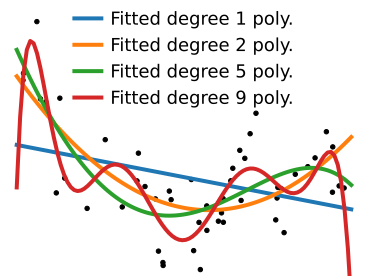

class: titlepage

.header[Lesson 4, MOOC Machine learning with scikit-learn]

# Overfit and underfit

This lesson covers overfit and underfit, important concepts to understand
why a model generalizes well or not to new data

???

---
# Which model do you prefer?

.pull-left[]

.pull-right[]

??

Let me start with a simple question: given the following data, which of
the two models do you prefer?

---
# Varying model complexity

.polynomial[]

* Data generated with 9th-degree polynomial + noise

???

Let us start with a simple case of simulated data: here we have simulated
data that is generated so that y is a 9th-degree polynomial function of X,
with some additional noise.

---
# Varying model complexity

.polynomial[]

* Data generated with 9th-degree polynomial + noise

* Fit polynomials of various degrees

???

What we will now do is fit to this data polymonials of various degrees.
We'll start with a polynomial of degree 1: a simple linear regression of
y on X. Clearly, this model does not explain well the data.

---
# Varying model complexity

.polynomial[]

* Data generated with 9th-degree polynomial + noise

* Fit polynomials of various degrees

???

If we fit a polynomial of degree 2, the fit is better.

---
# Varying model complexity

.polynomial[]

* Data generated with 9th-order polynomial + noise

* Fit polynomials of various degrees

???

Polynomial of degree 5: it's hard to tell whether it explains the data
better or not

---
# Varying model complexity

.polynomial[]

* Data generated with 9th-order polynomial + noise

* Fit polynomials of various degrees

???

And if we go all the way up to degree 9, the fit looks really bad

---
# Varying model complexity

.polynomial[]

* Data generated with 9th-order polynomial + noise

* Fit polynomials of various degrees

???

The actual function that the data was generated from looks like this,
though we added observational noise.

---
# Overfit versus underfit

.pull-left[]

.pull-right[]

