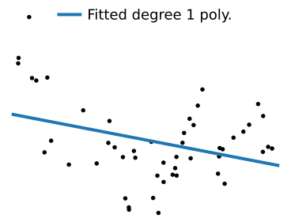
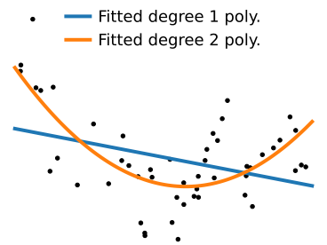
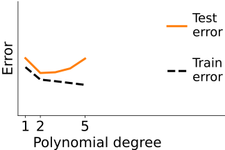
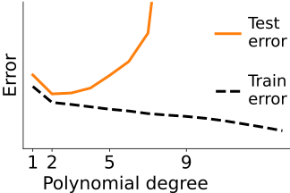

class: titlepage

.header[MOOC Machine learning with scikit-learn]

# Overfit and underfit

This lesson covers overfit and underfit. These are concepts important to
understand why a model generalizes well or not to new data

???

This lesson covers overfit and underfit, important concepts to understand
why a model generalizes well or not to new data

---
# Which data fit do you prefer?

.shift-left.pull-left[]

.pull-right[]

???

Let me start with a simple question: given the following data, which of
the two models do you prefer? I'll give you a moment to think about it.

Most people reply that they prefer the one with the straight line.
However, the one with the wiggly line fits the data perfectly, doesn't it?
So why might we prefer the straight line?

---
# Which data fit do you prefer?

.shift-left.pull-left[]
.pull-right[]
.centered.reversed[**On new data**]

???

Answering this question might be hard. However, in the context of machine
learning we aim for models that generalize. Hence, the good way to frame
the question is: how will the model perform on new data?

---
# Which data fit do you prefer?

.shift-left.pull-left[]
.pull-right[]
.centered[A harder example]

???

How about a slightly harder example? Which one should we choose?

In this course, we will the useful concepts to understand these
tradeoffs.

---
# Varying model complexity

.polynomial[]

* Data generated with 9th-degree polynomial + noise

???

In the latest example, we have generated the data so that y is a
9th-degree polynomial function of X, with some additional noise.

---
# Varying model complexity

.polynomial[]

* Data generated with 9th-degree polynomial + noise

* Fit polynomials of various degrees

???

What we will now do is fit to this data polymonials of various degrees.
We'll start with a polynomial of degree 1: a simple linear regression of
y on X. Clearly, this model does not explain well the data.

---
# Varying model complexity

.polynomial[]

* Data generated with 9th-degree polynomial + noise

* Fit polynomials of various degrees

???

If we fit a polynomial of degree 2, the fit is better.

---
# Varying model complexity

.polynomial[]

* Data generated with 9th-degree polynomial + noise

* Fit polynomials of various degrees

???

Polynomial of degree 5: it's hard to tell whether it explains the data
better or not

---
# Varying model complexity

.polynomial[]

* Data generated with 9th-degree polynomial + noise

* Fit polynomials of various degrees

???

And if we go all the way up to degree 9, the fit looks really bad

---
# Varying model complexity

.polynomial[]

* Data generated with 9th-degree polynomial + noise

* Fit polynomials of various degrees

???

The actual function that was used to generate the data looks like this,
though we added observational noise.

---
# Overfit: model too complex

.pull-left.shift-left[]

.pull-right.width50.shift-left[.shift-left[Model too complex for the data:]

* Its best possible fit would approximate well the generative process

* But its flexibility captures noise
]

???

In the case of the polynomial of degree 9, the problem that we face is
that the model that we use is too complex for the data at hand. This
problem is know as overfit in machine learning. With such a rich model,
its best possible fit would approximate well the data-generating process.
Indeed, here we are fitting a polynomial of degree 9 on data generated
with a polynomial of degree 9. However, due to limited data,
the model fit captures noise because it is too flexible.

--

.reversed[**Not enough data** &nbsp; &nbsp; **Too much noise**]

???

This problem is typically encountered when there is not enough data, or
too much noise.

---
# Overfit: variance 

.pull-left.shift-left[]

.pull-right.width50.shift-left[]

???

The problem of overfit is one of variance: on average, the predictions
are not really off, but each tends to fall far from the target. This can
be seen by their large spread around the best possible, and a useful
mental picture is that of the spread of arrows on a target.

---
# Underfit: model too simple

.pull-left.shift-left[]

.pull-right.width50.shift-left[Model too simple for the data:

* Its best fit does not approximate well the generative process

* Yet it captures little noise
]

???

At the opposit end of the spectrum, when we are fitting a polynomial of
degree 1, the model is too simple for the data at hand. We say that it
underfits. Its best possible fit cannot approximate well the
data-generating process. On the positive side, it captures little noise,
As a consequence even with limited data, the empirical fit is close to
the best possible fit on an infinite amount of data.

--

.reversed[**Plenty of data** &nbsp; &nbsp; **Low noise**]

???

Underfit is more common when there is plenty of data compared to the
complexity of the model, or in low-noise situations.

---
# Underfit: bias

.pull-left.shift-left[]

.pull-right.width50.shift-left[]

???

Unlike overfit, underfit leads to systematic biases: 
the predictions cannot be on target on average, because the model that we
use to predict is systematically off the data-generating process.

---
# Underfit versus overfit

.shift-left.pull-left[]

.pull-right[]

.shift-up.pull-left.shift-left[.centered.reversed[Bias]]
.shift-up.pull-right.width50[.centered.reversed[Variance]]

???

So we have these two opposit behaviors:
* and underfit, with systematic bias
* overfit, with large variance

The challenge is to find the right tradeoff between the two.

---
# Underfit versus overfit

.pull-left.width50[]
.pull-right.width50.shift-left[]

.shift-up.pull-left.shift-left[.centered.reversed[Bias]]
.shift-up.pull-right.width50[.centered.reversed[Variance]]

???

This bias-variance tradeoff is classic in statistics. Often, adding a
little bit of bias helps reducing the variance. For instance, as with
throwing darts at a target, where throwing the darts less strong might
lead to being below the target on average, but with less scatter.

---
class: center, middle

# How to choose this tradeoff

Between underfit and overfit

???

So, now that we understand that there is tradeoff between underfit and
overfit, the question is: from a practical standpoint, how do we choose
it?

---

# Train vs test error

.shift-left.pull-left[]
.width50.pull-right[
Compare:

* errors on the training data

* errors on the testing data

vary model complexity
]

---

# Train vs test error: increasing complexity

.shift-left.pull-left[]
.width50.pull-right[]

---

# Train vs test error: increasing complexity

.shift-left.pull-left[]
.width50.pull-right[]

---

# Train vs test error: increasing complexity

.shift-left.pull-left[]
.width50.pull-right[]

---

# Train vs test error: increasing complexity

.shift-left.pull-left[]
.width50.pull-right[]

