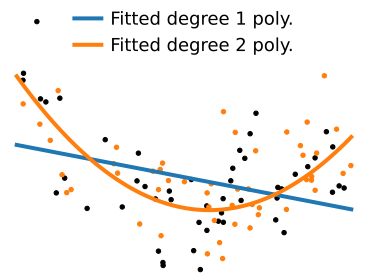
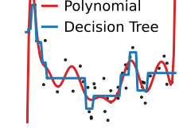

class: titlepage

.header[MOOC Machine learning with scikit-learn]

# Overfit and underfit

This lesson covers overfit and underfit. These are concepts important to
understand why a model generalizes well or not to new data

???

This lesson covers overfit and underfit, important concepts to understand
why a model generalizes well or not to new data

---
# Which data fit do you prefer?

.shift-left.pull-left[]

.pull-right[]

???

Let me start with a simple question: given the following data, which of
the two models do you prefer? I'll give you a moment to think about it.

Most people reply that they prefer the one with the straight line.
However, the one with the wiggly line fits the data perfectly, doesn't it?
So why might we prefer the straight line?

---
# Which data fit do you prefer?

.shift-left.pull-left[]
.pull-right[]
.centered.reversed[**On new data**]

???

Answering this question might be hard. However, in the context of machine
learning we aim for models that generalize. Hence, the good way to frame
the question is: how will the model perform on new data?

---
# Which data fit do you prefer?

.shift-left.pull-left[]
.pull-right[]
.centered[A harder example]

???

How about a slightly harder example? Which one should we choose?
This is a difficult question.

In this lesson, we will study useful concepts to understand these
tradeoffs.

---
# Varying model complexity

.polynomial[]

* Data generated with 9th-degree polynomial + noise

???

In the latest example, we have generated the data so that y is a
9th-degree polynomial function of X, with some additional noise.

---
# Varying model complexity

.polynomial[]

* Data generated with 9th-degree polynomial + noise

* Fit polynomials of various degrees

???

What we will now do is fit to this data polymonials of various degrees.
We'll start with a polynomial of degree 1: a simple linear regression of
y on X. Clearly, this model does not explain well the data.

---
# Varying model complexity

.polynomial[]

* Data generated with 9th-degree polynomial + noise

* Fit polynomials of various degrees

???

If we fit a polynomial of degree 2, the fit is better.

---
# Varying model complexity

.polynomial[]

* Data generated with 9th-degree polynomial + noise

* Fit polynomials of various degrees

???

Polynomial of degree 5: it's hard to tell whether it explains the data
better or not

---
# Varying model complexity

.polynomial[]

* Data generated with 9th-degree polynomial + noise

* Fit polynomials of various degrees

???

And if we go all the way up to degree 9, the fit actually looks really
bad

---
# Varying model complexity

.polynomial[]

* Data generated with 9th-degree polynomial + noise

* Fit polynomials of various degrees

???

The actual function that was used to generate the data looks like this,
though we added observational noise.

---
# Overfit: model too complex

.pull-left.shift-left[]

.pull-right.width50.shift-left[.shift-left[Model too complex for the data:]

* Its best possible fit would approximate well the generative process

* But its flexibility captures noise
]

???

In the case of the polynomial of degree 9, the problem that we face is
that the model that we use is too complex for the data at hand. This
problem is know as overfit in machine learning. With such a rich model,
its best possible fit would approximate well the data-generating process.
Indeed, here we are fitting a polynomial of degree 9 on data generated
with a polynomial of degree 9. However, due to limited data,
the model fit captures noise because it is too flexible.

--

.reversed[**Not enough data** &nbsp; &nbsp; **Too much noise**]

???

This problem is typically encountered when there is not enough data, or
too much noise.

---
# Overfit: variance 

.pull-left.shift-left[]

.pull-right.width50.shift-left[]

???

The problem of overfit is one of variance: on average, the predictions
are not really off, but each tends to fall far from the target. This can
be seen by their large spread around the best possible prediction. A useful
mental picture is that of the spread of arrows on a target.

---
# Underfit: model too simple

.pull-left.shift-left[]

.pull-right.width50.shift-left[Model too simple for the data:

* Its best fit does not approximate well the generative process

* Yet it captures little noise
]

???

At the opposite end of the spectrum, when we are fitting a polynomial of
degree 1, the model is too simple for the data at hand. We say that it
underfits. Its best possible fit cannot approximate well the
data-generating process. On the positive side, it captures little noise,
As a consequence even with limited data, the empirical fit is close to
the best possible fit on an infinite amount of data.

--

.reversed[**Plenty of data** &nbsp; &nbsp; **Low noise**]

???

Underfit is more common when there is plenty of data compared to the
complexity of the model, or in low-noise situations.

---
# Underfit: bias

.pull-left.shift-left[]

.pull-right.width50.shift-left[]

???

Unlike overfit, underfit leads to systematic biases: 
the predictions cannot be on target on average, because the model that we
use to predict is systematically off the data-generating process.

---
# Underfit versus overfit

.shift-left.pull-left[]

.pull-right[]

.shift-up.pull-left.shift-left[.centered.reversed[Bias]]
.shift-up.pull-right.width50[.centered.reversed[Variance]]

???

So we have these two opposit behaviors:
* underfit, with systematic bias
* and overfit, with large variance

The challenge is to find the right tradeoff between the two.

---
# Underfit versus overfit

.pull-left.width50[]
.pull-right.width50.shift-left[]

.shift-up.pull-left.shift-left[.centered.reversed[Bias]]
.shift-up.pull-right.width50[.centered.reversed[Variance]]

???

This bias-variance tradeoff is classic in statistics. Often, adding a
little bit of bias helps reducing the variance. For instance, as with
throwing darts at a target, where throwing the darts less strong might
lead to being below the target on average, but with less scatter.

---
class: center, middle

# How to choose this tradeoff

Between underfit and overfit

???

So, now that we understand that there is tradeoff between underfit and
overfit, the question is: from a practical standpoint, how do we choose
it?

---

# Train vs test error

.shift-left.pull-left[]
.width50.pull-right[
Measure:

* errors on test data (generalization)

* errors on the train data
]

???

To probe the tradeoff between underfit and overfit, our central
tool will be to measure both the generalization error, on unseen
test data, and the error on the data used to train the model

---

# Train vs test error: increasing complexity

.shift-left.pull-left[]
.width50.pull-right[]

???

We can look at these errors while varying model complexity.

If we start with a very simple model, the training error is similar to
the testing error: the model does not have enough capacity to capture
noise.

---

# Train vs test error: increasing complexity

.shift-left.pull-left[]
.width50.pull-right[]

???

As we increase model complexity, both the train and the test errors go
down: the model explains well the data, but does not capture noise yet.

---

# Train vs test error: increasing complexity

.shift-left.pull-left[]
.width50.pull-right[]

???

Even more complex models fit the training data better, but they start
capturing noise in their model fit. As a result, their error on the test
data is larger.

---

# Train vs test error: increasing complexity

.shift-left.pull-left[]
.width50.pull-right[]

???

As we keep increasing model complexity, the train error keeps going down,
but the test increases sharply. The model is overfitting.

---

# Train vs test error: increasing complexity

.centered[.shift-left[]]

.shift-up.centered[
.reversed[Underfit]
.reversed[Sweet spot]
.reversed[Overfit]
]

???

The big picture is that models that are too simple have similar train and
test error, while models that are too complex have a small train error
but a very large test error. There is a sweet spot in the middle, and
this is where good machine-learning models lie.

---
class: center, middle

# With varying sample size

Learning curves

???

Another useful way to look at the tradeoff between underfit and overfit
is with varying sample size. Such an analysis is often known as a
learning curve.

---

# Train vs test error: varying sample size

.shift-left.pull-left[]
.width50.pull-right[]

.reversed[Overfit]

???

If we fit a polynomial of degree 9 on a small dataset, we will not have
enough data and we will be in an overfit situation. As a result the train
error will be low, but the test error will be high.

---

# Train vs test error: varying sample size

.shift-left.pull-left[]
.width50.pull-right[]

???

As we increase the sample size, the test error decreases while
the train error increases: the models are less overfitting.

---

# Train vs test error: varying sample size

.shift-left.pull-left[]
.width50.pull-right[]

.reversed[Sweet spot?]

???

With enough data, the train and test errors converge: the model is no
longer overfit.

---

# Train vs test error: varying sample size

.shift-left.pull-left[]
.width50.pull-right[]

.reversed[Diminishing returns]

???

After a while, we reach diminishing returns: the test and the train error
are no longer changing: more data does not bring any benefits.

--

Try more complex models?

???

Given that more data are not improving model prediction, it may be useful
to try more complex models.

---

# Bayes rate: no improvement possible

.shift-left.pull-left[]
.width50.pull-right[
Here, the data-generating process is a degree-9 polynomial 

We cannot do better

Predictions limited by noise

]

???

In general, when adding more data does not provide improvements,
it is useful to try more complex models.

However, in the specific case of our example, the data-generating process
in a degree-9 polynomial. As a result, more complex models will not
improve the prediction: the present model has already captured all the
non-random link between X and y.

The corresponding prediction is imperfect. Yet, we cannot do better: the
prediction is limited by the intrinsic randomness of the link between X
and y.

---
class: middle

.center[
# Model families
]

.centered[
Crucial to match

.tight[
* statistical model

* data-generating process
]
]

.centered[So far: polynomes for both]

???

The excellent performance that we just observed for degree-9 polynomes
when there is plenty of data comes from the perfect match between the
statistical model used to analyse the data and the data-generating process. So far, we have used
polynomes for both of them. But in practice, given data, we seldom know
a simple form of model in which the data is drawn. 

For this reason, the choice of family of model is crucial.

---

# Different model families

.shift-left.pull-left[]
.pull-right.width[
* Different "inductive bias"

* Different notion of "complexity"
]

???

Different model families come with different form of bias, which we call
inductive bias, and of complexity.

For instance, polynomial regressions tend to be smooth, and their
complexity is controlled by the degree of the polynome used to fit the
data. On the other hand, decision trees are locally constant. Their
complexity is controlled by the number of constant regions that they fit.

---

# Different model families

.shift-left.pull-left[]
.pull-right[]

.shift-up.pull-left[.reversed[Simple variant]]
.shift-up.pull-right[.reversed[Complex variant]]

.centered[⇦ regularization ⇦]

???

Varying model complexity for these different families of model explores
different underfit and overfit behavior.

In general forcing a model towards a simpler fit is called
"regularization". In scikit-learn, and in machine learning in general,
almost every model comes with a specific regularization strategy. Part of
machine-learning practice is about understanding the inductive biases and
the regularization strategy to choose the right model. We will cover this
later, as we explore various models.

---

.center[
# Take home messages
]

Models too complex for the data **overfit**:

.tight[
- they explain too well the data that they have seen
- they do not generalize
]

Models too simple for the data **underfit**:

.tight[
- they capture no noise
- but are limited by their expressivity
]

Comparing train and test error reveals this tradeoff

Different models = different complexity and bias

???

Let me conclude this lesson by recapitulating the take home messages.

When the models are too complex for the data at hand, they overfit. This
means that they explain too well the data that they have seen as they
capture noise, and thus do not generalize to new data.

On the opposite, when models are too simple for the data at hand, they
underfit. This means that they capture no noise, but their ability to
generalize is then limited by their expressivity.

Comparing train and test error, for instance varying model complexity, or
amount of data, can reveal this tradeoff.

The notion of complexity, or the bias imposed by a model, are both
specific to a model family. We will later study different model families.

