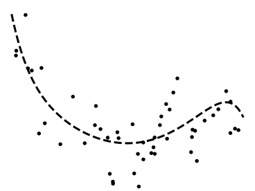
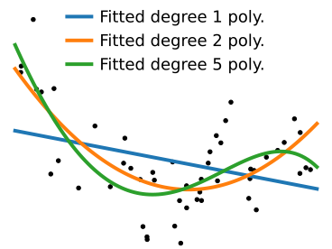
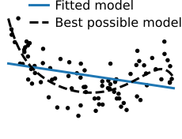

class: titlepage

.header[MOOC Machine learning with scikit-learn]

# Overfitting and underfitting

Understand when and why a model does or does not generalize well on unseen data.

???

This lesson covers the topics of overfitting and underfitting, 
which are important concepts to understand why a model does or 
does not generalize well to new data.

---
# Which data fit do you prefer?

.shift-left.pull-left[]

.pull-right[]

???

Let me start with a simple question: given the following data, which of
the two models do you prefer? I'll give you a moment to think about it.

Most people reply that they prefer the one with the straight line.
However, the one with the wiggly line fits the data perfectly, doesn't it?
So why might we prefer the straight line?

---
# Which data fit do you prefer?

.shift-left.pull-left[]
.pull-right[]
.centered.reversed[**On new data**]

???

Answering this question might be hard. However, in the context of machine
learning we aim at creating models that generalize. Hence, the good way 
of framing the question is: how will the model perform on new data?

---
# Which data fit do you prefer?

.shift-left.pull-left[]
.pull-right[]
.centered[A harder example]

???

How about a slightly harder example? Which one should we choose?
This is a difficult question.

In this lesson, we will study useful concepts to understand these
tradeoffs.

---
# Varying model complexity

.polynomial[]

* Data generated by a random process

    - Sample a value of the input *x*

    - Transform it with a 9th-degree polynomial

    - Add some noise to get the output *y*

???

In the latest example, we have generated the data so that *y* is a
9th-degree polynomial function of *X*, with some additional noise.

---
# Varying model complexity

.polynomial[]

* Data generated by a random process

* This process is unknown

* We can only access the observations

???

---
# Varying model complexity

.polynomial[]

* Data generated by a random process

* This process is unknown

* We can only access the observations

* Fit polynomials of various degrees

???

What we will now do is fit to this data polymonials of various degrees.
We'll start with a polynomial of degree 1: a simple linear regression of
*y* on *X*. Clearly, this model does not explain well the data.

---
# Varying model complexity

.polynomial[]

* Data generated by a random process

* This process is unknown

* We can only access the observations

* Fit polynomials of various degrees

???

If we fit a polynomial of degree 2, it is better.

---
# Varying model complexity

.polynomial[]

* Data generated by a random process

* This process is unknown

* We can only access the observations

* Fit polynomials of various degrees

???

Polynomial of degree 5: it's hard to tell whether it explains the data
better

---
# Varying model complexity

.polynomial[]

* Data generated by a random process

* This process is unknown

* We can only access the observations

* Fit polynomials of various degrees

???

And if we go all the way up to degree 9, the fit looks really bad

---
# Varying model complexity

.polynomial[]

* Data generated by a random process

* This process is unknown

* We can only access the observations

* Fit polynomials of various degrees

???

The actual function that was used to generate the data looks like this,
though we added observational noise.

---
# Overfit: model too complex

.pull-left.shift-left[]

.pull-right.width50.shift-left[.shift-left[Model too complex for the data:]

* Its best possible fit would approximate well the generative process

* However, its flexibility captures noise
]

???

In the case of the 9th-degree polynomial, the problem we face is
that the model we're using is too complex for the data at hand. This
problem is known as overfiting in machine learning. 
With such a rich model, its best possible fit would approximate well the 
data-generating process.
Indeed, here we are fitting a polynomial of degree 9 on data generated
with a polynomial of degree 9. However, due to the limited data,
the model fit captures noise because it is too flexible.

--

.reversed[**Not enough data** &nbsp; &nbsp; **Too much noise**]

???

This problem is typically encountered when there is not enough data, or too
much noise.

---
# Underfit: model too simple

.pull-left.shift-left[]

.pull-right.width50.shift-left[Model too simple for the data:

* Its best fit does not approximate well the generative process

* Yet it captures little noise
]

???

At the opposite end of the spectrum, when we are fitting a polynomial of
degree 1, the model is too simple for the data at hand. We say that it
underfits. Its best possible fit cannot approximate well the
data-generating process. On the positive side, it captures little noise,
As a consequence even with limited data, the empirical fit is close to
the best possible fit on an infinite amount of data.

--

.reversed[**Plenty of data** &nbsp; &nbsp; **Low noise**]

???

Underfit is more common when there is plenty of data compared to the
complexity of the model, or in low-noise situations.

---

.center[
# Take home messages
]

Models too complex for the data **overfit**:

.tight[
- they explain too well the data that they have seen
- they do not generalize
]

Models too simple for the data **underfit**:

.tight[
- they capture no noise
- they are limited by their expressivity
]

How to find the right trade-off?

???

When the models are too complex for the data at hand, they overfit. This
means that they explain too well the data that they have seen as they
capture noise, and thus do not generalize to new data.

On the opposite, when models are too simple for the data at hand, they
underfit. This means that they capture no noise, but they also don't capture
all the structured variations of the data: their ability to generalize 
is then limited by their expressivity.
