class: titlepage

.header[MOOC Machine learning with scikit-learn]

# Regularized Linear Models

How to avoid overfitting?


---
# Do linear models overfit?

- Linear models are simpler than alternatives
--

- → they tend to overfit less than alternatives
--

- They even often underfit when:
  - `n_features` is small (e.g. less than 10 features)
  - the problem is not linearly separable

--

But...

---
# Linear models can also overfit!

Possible causes:

- `n_samples << n_features`
- Many uninformative features


--
Example for linear regression:

.larger[
```
Sale_Price =      0.1 * Gr_Liv_Area
             +    1.1 * Year_Built
             -    8.9 * Full_Bath
             +    2.5 * First_Owner_Is_Born_In_January
             -    1.5 * First_Owner_Is_Born_In_February
             ...
             - 2200.0
```
]

???

Fitting linear models with thousands of unrelated features can make linear
models easily overfit any data.

One solution would be to filter-out useless features:

- it's somewhat possible using automated [feature selection methods](
    https://scikit-learn.org/stable/modules/feature_selection.html)

- but this is not always easy to tell if a given decision should be included or
  not

---
class: split-50
# Regularization can reduce overfitting

.column1[
Unregularized regression:

```python
from sklearn.linear_model \
    import LinearRegression

model = LinearRegression().fit(X, y)
 ```
]

--

.column2[
Ridge regression:

```python
from sklearn.linear_model import Ridge

model = Ridge(alpha=0.01).fit(X, y)
```
]

--
.nocolumn[
**Ridge regression** pulls the coefficients towards 0.
]

--
.nocolumn[
Large `alpha` → more regularization
]


--
.nocolumn[
**Recommendation**: always use `Ridge` with a carefully tuned `alpha`!
]

???

If we have too many input features with regards to the number of samples, the
linear model can overfit: it assigns non-zero weights to features that are
correlated with the target variable purely by chance on the training set and
this correlation would not generalize to future test data.

As described in a previous lecture, the problem with overfitting is that the
model learns a decision function that is too sensitive to training set specitic
details: here the non-zero associations to unrelated factors such as the birth
date of the first owner of the house. As a consequence, the model generalizes
poorly.

The solution is to regularize the model: to foster less complex solutions. For
this purpose, a linear model can be regularized by slightly biasing it to
choose smaller weights for an almost similar fit. This forces the coefficients
of the features to be very close to zero, unless they are really required to
reduce a comparatively large fraction of the training error.

The `Ridge` estimator does this in scikit-learn.

This model comes with a complexity parameter that controls the amount of
regularization. This parameter is named `alpha`. The larger the value of
`alpha`, the greater the regularization, and thus the smaller the coefficients.

---
class: split-40
# Regularization on a simple example

.column1[
.center[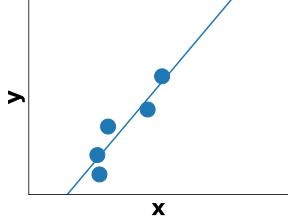]
]
.column2[
Small training set

Fit a linear model without regularization
]

???

To build an intuition on Ridge regression (regularized linear regression), let
us consider again a minimal case with a single input feature and a small
training set with just a few data points.

---
class: split-40
# Regularization on a simple example


.column1[
.center[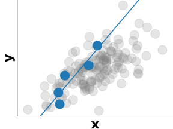]
]
.column2[
Small training set

Fit a linear model without regularization

Training points sampled at random

Can overfit if the data is noisy!
]


---
# Regularization on a simple example


--
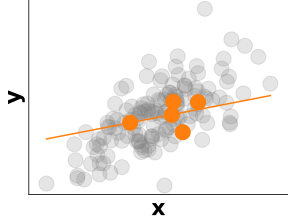
--

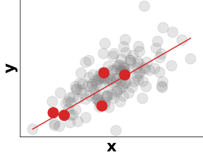
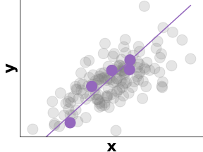
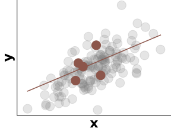

???

Let's observe how the slope of the model fitted without regularization could be
impacted if our linear regression model was trained on alternative training
sets (with the same size) sampled at random from the same data distribution.

This re-sampling of the training set can be simulated when following the
cross-validation procedure for instance.

---
class: split-50
# Bias-variance tradeoff in Ridge regression

.column1[
.center[]

`LinearRegression` (no&nbsp;regularization)

High variance, no bias.
]

--

.column2[
.center[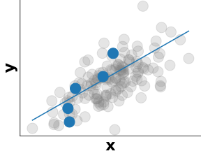]

`Ridge` regression (regularized)

Lower variance, but biased!
]

---
class: split-3columns
# Bias-variance tradeoff in Ridge regression

.column[


.center[Too much variance]

.center[`alpha` too small]
]

--

.column[
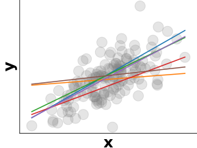

.center[Best tradeoff]
]

--

.column[
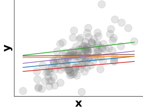

.center[Too much bias]

.center[`alpha` too large]
]

???

This is a typical example of bias/variance tradeoff: non-regularized
estimators are not biased, but they can display a lot of variance.
Highly-regularized models have little variance, but high bias.

This bias is not necessarily a bad thing: what matters is choosing the
tradeoff between bias and variance that leads to the best prediction
performance. For a specific dataset there is a sweet spot corresponding
to the highest complexity that the data can support, depending on the
amount of noise and observations available.

Given new data points, beyond our two initial measures, the sweep spot
minimizes the error. For the specific case of the `Ridge` estimator, in
scikit-learn, the best value of `alpha` can be automatically found
using the `RidgeCV` object.

Note that, in general, for prediction, it is always better to prefer
`Ridge` over a `LinearRegression` object. Using at least a small amount
of regularization is always useful.


---
class: split-50
# Automated tuning for regularization

.column1[
 ```python
from sklearn.linear_model \
    import Ridge
from sklearn.model_selection \
    import GridSearchCV


param_grid = {
    "alpha": [0.001, 0.1, 1, 10, 1000],
}
model = GridSearchCV(Ridge(), param_grid)
model.fit(X, y)

print(model.best_parameters_)
```
]

--
.column2[
 ```python
from sklearn.linear_model import RidgeCV


model = RidgeCV(
    alphas=[0.001, 0.1, 1, 10, 1000]
)
model.fit(X, y)

print(model.alpha_)
```

Almost as fast as fitting a single `Ridge` model!
]

???

It is possible to use cross-validation and the grid search procedure to tune
the value of alpha for a given problem.

But for ridge regression it's also possible to use the `RidgeCV` class that can
run a very efficient internal tuning procedure that can be significantly faster
than running a traditional grid search.

The selected value for the parameter `alpha` is stored as the attribute
`model.alpha_` after calling fit.

---
# Regularization in logistic regression

`LogisticRegression(C=1)` is regularized by default!

--

High&nbsp;C&nbsp;value&nbsp;→&nbsp;weaker regularization.

.shift-up-less.shift-left.pull-left[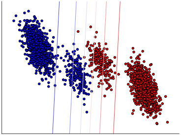]
.shift-up-less.pull-right[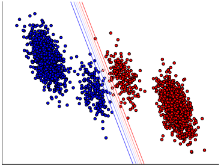]
.shift-up.pull-left.shift-left[&nbsp;&nbsp;Small `C`]
.shift-up.pull-right[&nbsp;&nbsp;Large `C`]

???

For classification, logistic regression also comes with regularization.


In scikit-learn, this regularization is controlled by a parameter called
`C`, which has a slightly different behavior than `alpha` in the Ridge
estimator.

For a large value of `C`, the model puts more emphasis on the data points
close to the frontier.
On the contrary, for a low value of `C`, the model considers all the points.

As with Ridge, the tradeoff controlled by the choice of `C` depends on
the dataset and should be tuned for each set. This tuning can be done in
scikit-learn using the `LogisticRegressionCV` object.

---
.center[
# Take home messages on linear models
]

* Can overfit when:

 - `n_samples` is too small and `n_features` is large
 -  In particular with non-informative features

--
* Regularization for **regression**:
 - linear regression → ridge regression
 - large `alpha` parameter → strong regularization

--
* Regularization **classification**:
 - logistic regression regularized by default
 - small `C` parameter → strong regularization

???

Always use regularization when fitting linear models: you can tune the
regularization parameter using cross-validation.

In particular for Ridge regression `RidgeCV` is efficient fast at tuning
`alpha` automatically.
