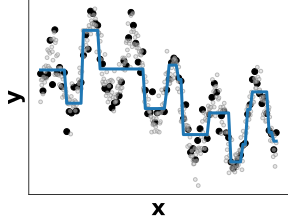
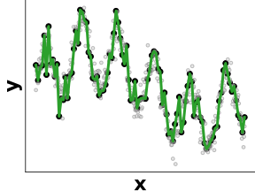

class: titlepage

.header[MOOC Machine learning with scikit-learn]

# Decision Trees

For regression and classification.

???

Decision tree are built as a set of rules for both
classification and regression problems.

These are the building blocks for more elaborate models such
as _random forest_ and _gradient boosting trees_, as we will see.

---

# Outline

- What is a decision tree?
- Training trees for classification & regression
- Impact of the tree depth on overfitting

---
class: center, middle

# What is a decision tree?

???

First, let us develop a bit the intuitions on what is a decision tree,
and how it can form the basis of classification and regression models.

---

# A example of a decision tree

.shift-up-more.shift-left[]

???
A decision tree is a set of rules, combined in a hierarchical manner.

In this example, if a new point has to be classified:

- we will first check the age feature, if it is lower than 28.5, we shall classify it as "low income".

- Otherwise, depending on the hours per week feature, we will classify it as low or high income.

---
class: center, middle

# Growing a classification tree

---
class: split-50
# Classification with a decision tree

.column1[

]
.column2[

]

???

On both sides of the threshold, each leaf node stores the number of training
points of each classes that reached that node by following the decisions
starting from the root noode.

On both sides of the threshold, we store in the child node the **number of
training points that reached that node for each possible value of `y`**.

Whenever we add a new split node, the selected feature and the optimal
threshold are tuned by maximizing the improvement in a quantity named entropy
or gini index that measures how mixed are the classes in the nodes. The goal is
to find splits such that both child nodes are as pure as possible

For test data points, we start again from the root of the tree and the same
thresholds is used to decide which branch to follow at each split node until
the test sample reaches a leaf node.

The tree predicts the fraction of training points of each class that reached
that node, divided by the total number of training points that reached that node. Those values can be interpreted as **class assignment probabilities**.

---
class: split-50
# Classification with a decision tree

.column1[

]
.column2[

]

???

We can incrementally expand any leaf to refine the decision function.
At each step, the leaf focuses on a smaller subregion of the space.

---
class: split-50
# Classification with a decision tree

.column1[

]
.column2[

]

???
In this example, after two splits, we obtain pure leaves.
i.e. in each leaf, there is only one class.
The max depth here is equal to 2. We do not need to go deeper.

---
class: center, middle

# Growing a regression tree

---
# Regression with a decision tree
.center[

]

???
Decision trees can also fit regression problems.

Let's consider the following simple regression problem with a single feature
as input on the `x` axis. The `y` axis represent the continuous value of
the `y` variable.

Each black point represents a training data points.

Observe that it is not possible to use a straight line to approximate this
dataset. One could therefore expect simple linear regression models to underfit
on this problem.

---
class: split-50
# Regression with a decision tree

.column1[

]
.column2[

]

???
As for classification we choose one feature and threshold value is selected for
a this feature to define the root of the tree (the first split node).

On both sides of the threshold, we store in the child node the **average value
of `y`** for each training point that reached that node.

Whenever we add a new split node, the selected feature and the optimal
threshold are tuned by maximizing the improvement in prediction error that
would result by the introduction of the split.

For test data points, we start again from the root of the tree and the same
thresholds is used to decide which branch to follow at each step until the test
sample reaches a leaf node.

The tree predicts the numerical value stored in the selected leaf node.

As a result the decision tree prediction function is always piece-wise
constant.

---
class: split-50
# Regression with a decision tree

.column1[

]
.column2[

]
???
At each iteration, one considers which leaf node node can be further replaced
by a split node to refine the prediction function, therefore replacing it by a
new split node and 2 new leaf nodes.

---
class: split-50
# Regression with a decision tree

.column1[

]
.column2[

]
???
The learning algorithms stops developing the trees either when there is only
one data points per leaf node or when we have reached pre-defined tree size,
expressed either as a maximum depth or maximum number of leaf nodes.

Decision Trees are non-parametric models: the maximum size of the tree depends
on the number of data points in the training set: it is not possible to develop
a very deep decision tree on a training set with just a few training point.

Choosing a maximum size can significantly impact the generalization performance
of the model.

---
class: center, middle

# Tree depth and overfitting

How the maximum depth impacts generalization?

---
class: split-3columns
# Tree: underfit / overfit tradeoff

.column[

]

--

.column[

]

--

.column[

]

--

.column[
.center[Underfitting]

.center.small[`max_depth` or `max_leaf_nodes` too&nbsp;small]
]

.column[
.center[Best trade-off]
]

.column[
.center[Overfitting]

.center.small[`max_depth` or `max_leaf_nodes` too&nbsp;large]
]

---

# Take home messages

- Sequence of simple decision rules:

  one feature and one threshold at a time

--

- No scaling required for numerical features

--

- `max_depth` controls the trade-off between underfitting and overfitting

--

- Mostly useful as a building block for ensemble models
  - Random Forests
  - Gradient Boosting Decision Trees

???

Tree-based models are very nice because they are invariant to rescaling of
numerical features.

The fact that there decision function is very "axis-aligned" (one feature with
one threshold at a time) make them work very whell on tabular datasets where
different columns have very different physical units.

However there piecewise constant nature makes there prediction function
non-smooth.

Individual decision trees are therefore are almost never competitive on their
own but they can become very strong models when combined in ensembles which can
make the prediction function much smoother.
