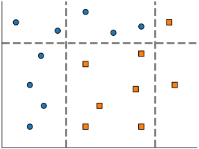
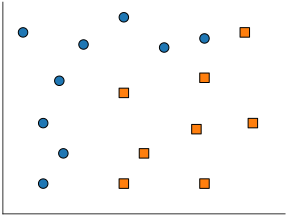
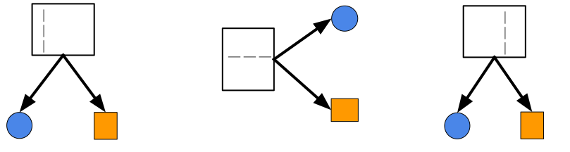

class: titlepage

.header[MOOC Machine learning with scikit-learn]

# Decisions trees

This lesson covers decision tree and random forest. These are robust models for both rergession and classification.

???

Decision tree, random forest

---
# Outline

* What is a decision tree?
* For classification & rergession
* Decision tree and random forest
* How to avoid overfitting?

---
# Example
.shift-left[]

???
A decision tree is a set of rules, combined in a hierarchical manner.

In this example, if a new point have to be classified :
- we will first check the age feature, if it is lower than 28.5, we shall classified it as "low income".
- Otherwise, depending of the hours per week feature, we will classified it as low or high income.

---
# Classification
.pull-left.shift-left[]

.pull-right[]

???
Each split shall maximize the information gain. This will be define precisely in the corresponding notebook.

---
# Classification
.pull-left.shift-left[]

.pull-right[]
 
???
We can expand a leaf to refine the decision

---
# Classification
.pull-left.shift-left[]
 
.pull-right[]
 
???
In this example, after two split, we obtain pure leaf. 
i.e. in each leaf, there is only one class. 

---
# Regression

???
Decision tree can also fit regression problem. 

---
# Regression

???

It will arrange the split w.r.t. the value of *x*.

---
# Regression

???

But it can also overfit.
Controling the depth allow to control the overfit.

---
# Boosting
.pull-left[]

???
Here we have a classification task. 

---
# Boosting
.pull-left[]
.pull-right[]
???
A first tree start to separate circle from square
---
# Boosting
.pull-left[]
.pull-right[]

???
The second tree refine the first model
---
# Boosting
.pull-left[]
.pull-right[]
???
A third tree keep refining the model.

---
# Bagging
.pull-left[]
.pull-right[]
???

---
# Bagging
.pull-left[]
.pull-right[]

.pull-right[]
???

---
# Bagging
.pull-left[]
.pull-right[]

.pull-right[]
 
.pull-right[]
???

---
# Take away

* `max_depth` parameter can prevent overfiting
* `Random Forest` use bagging over decision tree
