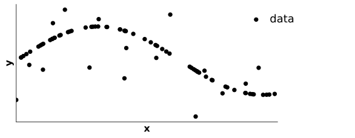
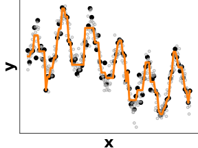
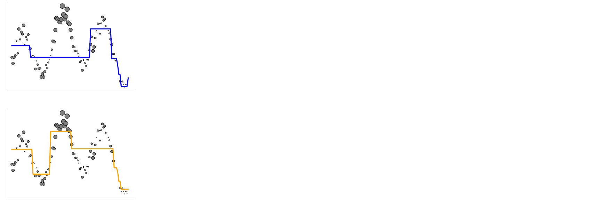
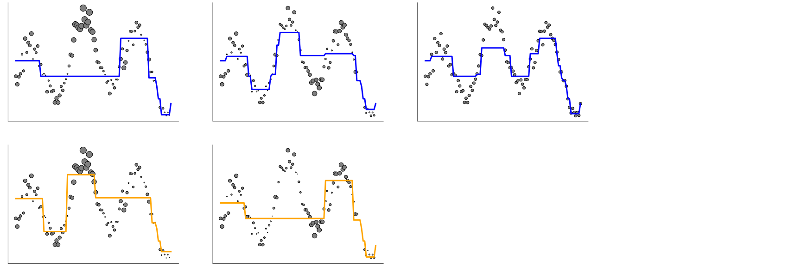
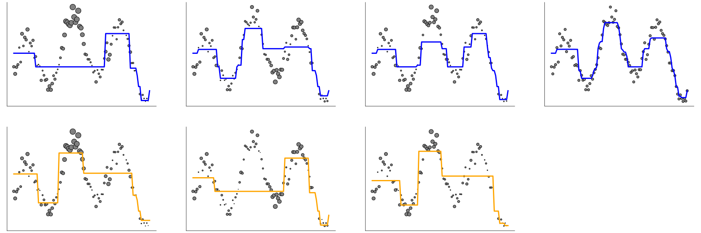
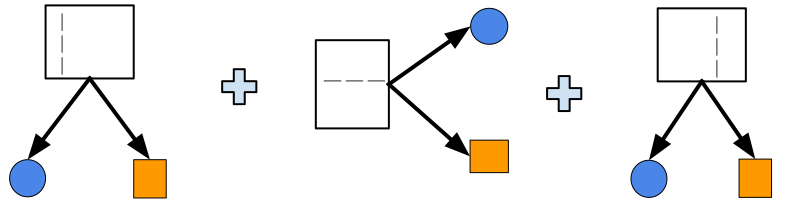

class: titlepage

.header[MOOC Machine learning with scikit-learn]

# Decisions trees

This lesson covers decision tree and random forest. 

These are robust models for both rergession and classification.


???
Decision tree are built as a set of rules for both classification and regression problems.

These are the building blocks for more ellaborate model such as random forest and gradient boosting trees, as we will see.


---
# Outline

* What is a decision tree?
* For classification & rergession
* Boosting and Bagging


---
# Example
.shift-left[]

???
A decision tree is a set of rules, combined in a hierarchical manner.

In this example, if a new point have to be classified :
- we will first check the age feature, if it is lower than 28.5, we shall classified it as "low income".
- Otherwise, depending of the hours per week feature, we will classified it as low or high income.

---
# Classification
.pull-left.shift-left[]

.pull-right[]

???
Each split shall maximize the "information gain". That will be define precisely in the following notebook.

---
# Classification
.pull-left.shift-left[]

.pull-right[]
 
???
We can incrementaly expand any leaf to refine the decision function. At each step, the leaf focuses on a smaller subregion of the space.

---
# Classification
.pull-left.shift-left[]
 
.pull-right[]
 
???
In this example, after two split, we obtain pure leaf. 
i.e. in each leaf, there is only one class. 
The max depth here is then egal to 2. We do not need to go deeper.

---
# Regression


???
Decision tree can also fit regression problem. 

---
# Regression


???
It will arrange the split w.r.t. the value of *x*. 
Without making any assumption on any distribution. It is a non-parametric model.

---
# Regression

???

But it can also overfit.
Controling the depth here allow to control the overfit.


---
# Decision tree





.shift-up-less[
&nbsp; &nbsp; Underfit &nbsp; &nbsp; &nbsp; &nbsp; &nbsp; &nbsp; &nbsp; &nbsp; &nbsp; &nbsp; Best tradeoff &nbsp; &nbsp; &nbsp; &nbsp; &nbsp;
&nbsp; &nbsp; &nbsp; &nbsp; &nbsp; Overfit
] 

.shift-up-less[
&nbsp; &nbsp; Small depth &nbsp; &nbsp; &nbsp; &nbsp; &nbsp; &nbsp;
&nbsp; &nbsp; &nbsp; &nbsp; &nbsp; &nbsp; &nbsp; &nbsp; &nbsp; &nbsp;
&nbsp; &nbsp; &nbsp; &nbsp; &nbsp; &nbsp; &nbsp; &nbsp;
Large depth
]


---
# Bagging
.pull-left[]

---
# Bagging


---

# Bagging


--


???

In bagging we will construct deep tree in parallel.


Each tree will be fitted on an sub-sampling from the initial data. 
i.e. we will only consider a random part of the data to build each model.

When we have to classify a new point, we will agregate the prediction of every model by a voting scheme.

---


# Bagging
.pull-left[]
.pull-right[]

.width65.shift-up-less.centered[
```python
from sklearn.ensemble import RandomForestClassifier
```
]

???
Here we have a classification task. Seprating circle from  square. 
---
# Bagging
.pull-left[]
.pull-right[]

.pull-right[]

.width65.shift-up-less.centered[
```python
from sklearn.ensemble import RandomForestClassifier
```
]

???


---
# Bagging
.pull-left[]
.pull-right[]

.pull-right[]
 
.pull-right[]

.width65.shift-up-less.centered[
```python
from sklearn.ensemble import RandomForestClassifier
```
]

???


---
# Boosting

---
# Bossting

---
# Bossting

---
# Boosting

---
# Bossting

---
# Bossting

---
# Boosting

---
# Bossting

---
# Bossting

---
# Boosting


???

---
# Boosting
.pull-left[]

???


---
# Boosting
.pull-left[]
.pull-right[]

???
A first shalow tree start to separate circle from square. Mistakes done by this first tree model shall be corrected by a second tree model.

---
# Boosting
.pull-left[]
.pull-right[]

.width65.shift-up-less.centered[
```python
from sklearn.ensemble import HistGradientBoostingClassifier
clf = HistGradientBoostingClassifier(learning_rate = .1)
```
]

???
So now, the second tree refine the first tree. The final model is a weighted sum of this first two trees.

---
# Boosting
.pull-left[]
.pull-right[]

.width65.shift-up-less.centered[
```python
from sklearn.ensemble import HistGradientBoostingClassifier
clf = HistGradientBoostingClassifier(learning_rate = .1)
```
]

???
We could continue to refining our ensemble model. At each step we focus on mistakes of the previous model.

---
# Take away

* `max_depth` parameter can prevent overfiting
* `Random Forest` use bagging over decision trees
* `boosting` fit sequentialy shallow trees
* `bagging` fit simultaneously deep trees
