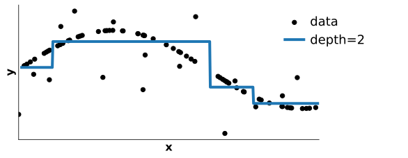

class: titlepage

.header[MOOC Machine learning with scikit-learn]

# Tree-based models

This lesson covers decision trees.

These are models for both regression and classification.

???
Decision tree are built as a set of rules for both
classification and regression problems.

These are the building blocks for more elaborate models such
as _random forest_ and _gradient boosting trees_, as we will see.

---

# Outline

- What is a decision tree?
- For classification & regression

---

class: center, middle

# What is a decision tree?

How does it build classification and regression models ?

???

First, let us develop a bit the intuitions on what is a decision tree,
and how it can form the basis of classification and regression models.

---

# A example of a decision tree

.shift-up-more.shift-left[]

???
A decision tree is a set of rules, combined in a hierarchical manner.

In this example, if a new point has to be classified:

- we will first check the age feature, if it is lower than 28.5, we shall classify it as "low income".
- Otherwise, depending on the hours per week feature, we will classify it as low or high income.

---

# Classification with a decision tree

.pull-left.shift-left[]

.pull-right[]

???
Each split shall maximize the "information gain".
That will be defined precisely in the following notebook.

---

# Classification with a decision tree

.pull-left.shift-left[]

.pull-right[]

???
We can incrementally expand any leaf to refine the decision function.
At each step, the leaf focuses on a smaller subregion of the space.

---

# Classification with a decision tree

.pull-left.shift-left[]

.pull-right[]

???
In this example, after two splits, we obtain pure leaves.
i.e. in each leaf, there is only one class.
The max depth here is equal to 2. We do not need to go deeper.

---

# Regression with a decision tree

???
Decision trees can also fit regression problems.

---

# Regression with a decision tree

???
It will arrange the split w.r.t. the value of _x_.
Without making any assumption on any distribution.
It is a non-parametric model.

---

# Regression with a decision tree

???

However, it can also overfit.
Controlling the depth here allows to control the overfitting.

---

# Tree: underfit / overfit tradeoff

.shift-up-less[
&nbsp; &nbsp; Underfit &nbsp; &nbsp; &nbsp; &nbsp; &nbsp; &nbsp; &nbsp; &nbsp; &nbsp; &nbsp; Best tradeoff &nbsp; &nbsp; &nbsp; &nbsp; &nbsp;
&nbsp; &nbsp; &nbsp; &nbsp; &nbsp; Overfit
]

.shift-up-less[
&nbsp; &nbsp; Small depth &nbsp; &nbsp; &nbsp; &nbsp; &nbsp; &nbsp;
&nbsp; &nbsp; &nbsp; &nbsp; &nbsp; &nbsp; &nbsp; &nbsp; &nbsp; &nbsp;
&nbsp; &nbsp; &nbsp; &nbsp; &nbsp; &nbsp; &nbsp; &nbsp;
Large depth
]

---

# Take away

- Successive binary rule considering a single feature;
- `max_depth` controls the trade-off between underfitting and overfitting.
